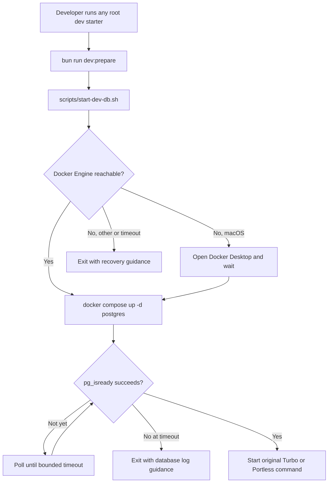

# Plan: Automatic Local Database Readiness for Dev Starters

## Type
Feature

## Status
Done

## Created Date
2026-06-20

## Last Updated
2026-06-20

## Goal Or Problem
Ensure every root development starter brings the local PostgreSQL database online and waits until it is ready before starting application processes.

## Current Context
The root `package.json` starts Turbo directly for `dev`, app-specific starters, and Portless starters. The repository has no Compose definition or database readiness helper, so development can start while PostgreSQL is absent or still booting. The configured local `DATABASE_URL` targets PostgreSQL on `localhost:5432` with database `amanah_cooperative`. The `school-clerk` reference project solves this with an idempotent `db:start` script that starts a Compose service, waits for Docker when possible, and polls PostgreSQL with `pg_isready` before allowing development commands to continue.

## Proposed Approach
Adopt the `school-clerk` startup contract under Halaalvest-specific names. Add a root Compose service for the existing local PostgreSQL endpoint and a portable `scripts/start-dev-db.sh` helper that verifies Docker, starts only the database service, and blocks until PostgreSQL reports ready. Add `db:start` and `dev:prepare` root scripts, then make every existing root `dev*` starter run `dev:prepare` before Turbo. Keep the helper idempotent so repeated or concurrent developer starts reuse the same healthy container. Preserve application starter filters and Portless behavior after preparation succeeds. Do not add School Clerk's unrelated port-killing behavior.

## Visual Plan

## Implementation Steps
- Add `docker-compose.yml` with a PostgreSQL service, persistent named volume, host port, database name, credentials, restart policy, and health check aligned with the existing local `DATABASE_URL` contract.
- Add `scripts/start-dev-db.sh`, adapted from `school-clerk`, with Halaalvest-specific override variables, Docker availability handling, `docker compose up -d`, bounded `pg_isready` polling, and actionable failures.
- Add root `db:start` and `dev:prepare` scripts in `package.json`.
- Prefix `dev`, `dev:api`, `dev:web`, `dev:dashboard`, `dev:portless`, and all app-specific `dev:*:portless` scripts with `bun run dev:prepare &&`, preserving their current Turbo filters and arguments.
- Consider routing database-dependent local commands such as `db:migrate` and `db:studio` through `db:start` for consistency with the reference project, without changing production migration behavior.
- Document the automatic database startup, Docker prerequisite, direct `db:start` command, readiness behavior, and troubleshooting command in `README.md`.

## Affected Files Or Areas
- `package.json`
- `docker-compose.yml`
- `scripts/start-dev-db.sh`
- `README.md`
- Local PostgreSQL development environment and persistent Docker volume

## Acceptance Criteria
- Running any existing root `dev*` starter starts the configured local PostgreSQL service when it is stopped.
- Application processes do not start until `pg_isready` confirms the configured database is accepting connections.
- Running a starter while the database container is already healthy is safe and proceeds without recreating or resetting data.
- All current Turbo filters, parallel behavior, and Portless behavior remain unchanged after database preparation.
- A missing or unreachable Docker Engine produces actionable guidance and a non-zero exit instead of starting partially functional apps.
- A database readiness timeout produces a non-zero exit and identifies the Compose logs command for diagnosis.
- Local data survives container restarts through a named volume.

## Test Plan
- With Docker running and no database container, run `bun run dev:api`; verify the service starts, readiness succeeds, and the API starts afterward.
- With the database already healthy, rerun `bun run dev:api`; verify startup is idempotent and existing data remains intact.
- Repeat a smoke start for `bun run dev`, each app-specific starter, `bun run dev:portless`, and each app-specific Portless starter; verify the original Turbo scope is preserved.
- Stop Docker and run a starter on macOS; verify Docker Desktop is opened, the helper waits, and startup resumes only after the engine and database are ready.
- Make Docker unavailable or configure an invalid Compose service; verify the command exits with useful recovery guidance.
- Force a short readiness timeout against an unavailable database; verify the helper exits non-zero and prints the relevant logs command.
- Confirm the Compose host port and database name match the non-secret endpoint fields in the repository's local `DATABASE_URL` configuration.

## Risks / Edge Cases
- Host port `5432` may already be occupied by a developer-managed PostgreSQL process; Compose must fail clearly rather than silently connecting to the wrong database.
- Automatically opening Docker Desktop is macOS-specific; other platforms need concise manual-start guidance.
- Multiple development starters launched close together may call `db:start` concurrently; Compose startup and readiness polling must remain idempotent.
- Existing developers may already have a PostgreSQL database on `localhost:5432`; rollout guidance should explain migration or the supported Compose override variables without deleting data.
- Production and CI commands must not unexpectedly attempt to launch a local Docker database.

## Open Questions
- None. Automatically starting PostgreSQL for `db:migrate` and `db:studio` is deferred outside this feature's completed `dev*` starter scope.

## Linked Task
- Task Title: Add automatic local database readiness to dev starters
- Task File: brain/tasks/done.md
