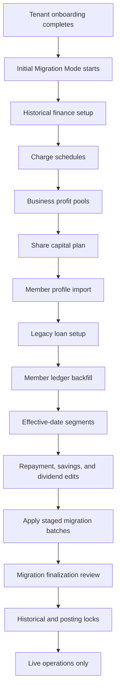

# Plan: Initial Cooperative Migration And Member Ledger Backfill

## Type
Feature

## Status
Proposed

## Created Date
2026-06-20

## Last Updated
2026-06-20

## Goal Or Problem
New cooperative tenants need a one-time initial migration mode that lets staff bring historical finance records into the system before live operations begin. This mode should configure historical charge schedules, business profit pools, share capital plans, legacy member loans, and member ledger backfill records. After migration is reviewed and finalized, these migration tools must be hidden or read-only, and all future activity must use the normal live workflows.

The feature must protect financial correctness by separating setup schedules from posted ledger records, applying member history idempotently, preserving an audit trail, and locking historical migration inputs once the cooperative enters live operations.

## Current Context
- Existing Brain context in `brain/features/onboarding-finance-setup-and-member-backfill.md` already covers tenant finance setup and member backfill, with a partial implementation slice.
- Existing package boundary `packages/backfill` already owns month generation, warning derivation, loan propagation, summaries, and draft generation.
- Existing Prisma model groups already include `TenantShareStructureVersion`, `MemberShareOverride`, `MemberAmountLog`, `ChargeDefinitionVersion`, `ShareBusiness`, `ShareBusinessProfitEntry`, `MemberShareLedgerEntry`, `ShareProfitAllocation`, `BackfillBatch`, `BackfillMonthRow`, and `BackfillActivity`.
- Existing dashboard surfaces include `apps/dashboard/src/app/(app)/(sidebar)/settings/finance/page.tsx`, `apps/dashboard/src/app/(app)/(sidebar)/settings/imports/page.tsx`, `apps/dashboard/src/components/tenant-finance-page-view.tsx`, and `apps/dashboard/src/components/modals/backfill-history-modal.tsx`.
- Existing import batching lives in `packages/db/src/queries/imports.ts` and the dashboard import workspace stages CSV/Excel-like batches before applying.
- Existing onboarding status in `packages/db/src/queries/onboarding.ts` checks tenant profile, domains, workspace owner, policy defaults, charge setup, and ledger bootstrap, but does not yet enforce a one-time historical migration lifecycle.
- Existing dashboard write paths are mostly server actions in `apps/dashboard/src/lib/dashboard-actions.ts`; `apps/api` owns the Hono/tRPC service boundary for shared or external API access.

## Proposed Approach
Treat this as a gated, one-time `Initial Migration Mode`, not as an ongoing settings feature. The workflow should move through explicit statuses:
- `not_started`
- `historical_setup_in_progress`
- `member_migration_in_progress`
- `migration_review`
- `finalized`
- `live_operations`

Use `packages/backfill` as the current historical finance calculation boundary, but update its public API naming toward migration language. Prefer names such as `buildMemberLedgerBackfill`, `resolveChargeSchedule`, `resolveShareCapitalPlan`, `resolveLegacyLoanSchedule`, `groupRowsByEffectiveDateSegment`, `applyLumpSumRepayment`, `calculateOutstandingLoanPrincipalBalance`, and `calculateNetSavingsContribution`. If the scope later expands beyond backfill, consider a deliberate package rename to `packages/finance-migration`.

Add a strict migration gate after onboarding and before live record creation. Tenant admins with incomplete migration should be routed into the initial migration flow. Non-admin staff should see a blocked state with no create/update actions. Once migration is finalized, historical migration routes should be hidden or read-only and all write actions should reject migration edits unless an emergency admin unlock is explicitly active.

Use industry-proof domain terms throughout the implementation:
- `Initial Migration Mode`: the one-time onboarding state for legacy data capture.
- `Historical Finance Setup`: tenant-level migration configuration before member import.
- `Charge Schedule`: effective-dated charge setup.
- `Charge Assessment`: a posted charge against a member.
- `Share Capital Plan`: cooperative-wide fixed or percentage-based share rule.
- `Share Capital Ledger`: member-level share capital postings.
- `Gross Contribution`: amount paid/saved before deductions.
- `Charge Deductions`: charges assessed against the contribution.
- `Share Capital Contribution`: amount moved into the member's share ledger.
- `Net Savings Contribution`: final savings after charge and share deductions.
- `Running Savings Balance`: cumulative savings balance derived from postings.
- `Running Share Capital Balance`: cumulative share capital derived from share ledger entries.
- `Business Profit Pool`: cooperative business profit available for allocation.
- `Profit Allocation`: member-level share of a business profit pool.
- `Dividend Distribution`: published/posted member profit credit.
- `Legacy Loan` or `Opening Loan Position`: loan that existed before system go-live.
- `Scheduled Monthly Repayment`: expected monthly loan repayment.
- `Repayment Override`: one-month repayment change.
- `Lump-Sum Repayment`: larger one-time repayment.
- `Outstanding Loan Principal Balance`: original principal minus principal repayments only. Fees, profit, or charges are tracked separately and never included in this balance.
- `Effective-Date Segment`: a table segment where resolved rules stay constant.
- `Migration Finalization`: final review and go-live lock.
- `Historical Lock`: lock preventing historical setup edits after go-live.
- `Posting Lock`: lock preventing silent mutation of applied financial records.

Sequence the initial migration flow as:
1. Set cooperative finance start date.
2. Configure charge schedules.
3. Configure business profit pools.
4. Configure share capital plan.
5. Import or create member profiles.
6. Configure member legacy loans.
7. Generate member ledger backfill tables.
8. Review warnings and apply migration batches.
9. Finalize migration and enter live operations.

For charge schedules, separate charge frequency from charge value type:
- `chargeFrequency`: `recurring_monthly`, `per_contribution`, `one_time`, `manual`.
- `chargeValueType`: `fixed_amount`, `percentage`.

For share capital, support:
- `shareValueType`: `fixed_amount`, `percentage`.
- `shareBasis`: default to contribution amount after charge deductions, based on the user's clarification that charges and share should apply to the loan-period savings amount when a loan is active.

For legacy member loans, add a setup step before the member backfill table. Each member can have zero, one, or multiple legacy loans, even though multiple concurrent loans should be uncommon. The basic legacy loan input is:
- disbursement date
- principal amount
- scheduled monthly repayment
- loan-period savings contribution
- optional expected settlement date
- optional amount repaid before migration range
- notes/reference

During an active legacy loan, the loan-period savings contribution replaces the member's normal savings contribution. Applicable charges and share capital deductions should be calculated from that loan-period savings contribution. When the loan is settled, a new `Effective-Date Segment` starts and the loan columns disappear from subsequent table segments.

The generated member ledger table should show one or more effective-date segments. Example active-loan segment columns:
- `Period`
- `Loan X Repayment (500)`
- `Savings During Loan`
- `Charge X (100)`
- `Charge Y (50)`
- `Share Capital (100 | 10%)`
- `Net Savings Contribution`
- `Outstanding Loan Principal Balance`
- `Running Savings Balance`

Repayment and savings cells should be clickable:
- Clicking loan repayment opens a form for actual repayment amount, one-time repayment override, lump-sum repayment, notes, and save.
- Clicking savings during loan opens a form for actual savings amount, one-time savings override, optional future enhancement for "from this month onward", notes, and save.
- A one-time edit creates a new effective-date segment around that month. The following month returns to the scheduled amount unless the loan has been fully settled.

Dividend/profit cells should open a modal showing business detail, profit amount, total disbursed, total available, and amount already allocated to the current member. Saving writes through `ShareBusinessProfitEntry` and `ShareProfitAllocation` and later publishes as a `DividendDistribution` or the existing dividend allocation model.

Use append-only or reversal-first posting patterns after migration is applied. Historical schedules may be edited while migration is in progress, but applied member postings should not be silently mutated. Corrections should be made through reversal, adjustment, or superseding records with audit logs.

Add a `Migration Finalization` screen before go-live. It should show member counts, missing member histories, active legacy loans, total imported opening savings, total share capital, total outstanding loan principal balance, total business profit pools, total profit allocations, warnings, and final confirmation. Once finalized, migration routes become hidden or read-only; server actions reject migration writes; and future corrections use live adjustment/reversal flows.

Use Midday-style layering:
- Keep route files thin in `apps/dashboard/src/app`.
- Put dashboard-local workflow components under `apps/dashboard/src/components`.
- Keep forms in `apps/dashboard/src/components/forms`.
- Keep high-volume member history table behavior in a dedicated table/module folder with stable columns, virtualized rows, sticky identifiers, loading states, empty states, and no nested card-heavy layout.
- Put reusable calculation, effective-date segmentation, validation, and warning logic in `packages/backfill`.
- Put Prisma access and tenant-scoped transactions in `packages/db/src/queries`.
- Add jobs only for heavy imports, batch apply, or replay operations that should not block the UI.

## Visual Plan

## Implementation Steps
- Add a tenant migration lifecycle contract in `packages/domain` or `packages/backfill` with statuses for initial migration mode, review, finalized, and live operations.
- Extend `packages/db/src/queries/onboarding.ts` or add a dedicated tenant migration query that returns migration status, missing setup steps, lock state, emergency unlock state, and redirect metadata.
- Add lock enforcement helpers in `packages/db/src/queries/tenant-finance.ts`, `packages/db/src/queries/charges.ts`, `packages/db/src/queries/members.ts`, `packages/db/src/queries/backfill.ts`, and loan query modules.
- Add or extend Prisma models for migration status, migration finalization metadata, emergency unlock metadata, charge frequency/value type, share value type, share basis, legacy loan setup, repayment overrides, and migration idempotency keys.
- Update protected dashboard layout and relevant server actions so incomplete migration blocks member, contribution, charge, loan, repayment, monthly record, import, and backfill writes until migration is ready or finalized.
- Replace current finance setup cards with a step-based initial migration experience using shadcn-style `Tabs`, `Table`, `Dialog`, `AlertDialog`, `Badge`, `Button`, `Input`, `Select`, and `Tooltip` primitives from `@halaalvest/ui`.
- Add editable charge schedule tables with effective date/value rows, trailing empty row behavior, validation for overlapping effective dates, and historical lock warnings.
- Extend business profit models or metadata to include profit expenses/charges, reason, final allocatable profit, and status when those are not represented by existing fields.
- Expand `packages/backfill` types to include charge frequency, charge value type, share basis, legacy loans, scheduled repayment, repayment overrides, lump-sum repayments, outstanding principal balance, row-level savings overrides, effective-date segment signatures, cumulative share capital, net savings contribution, running savings balance, and profit allocation context.
- Implement `resolveLegacyLoanSchedule` and loan settlement logic in `packages/backfill`.
- Implement `groupRowsByEffectiveDateSegment` in `packages/backfill` so the UI receives table segments with stable columns and segment headings.
- Implement repayment and savings edit actions that create one-time overrides and recompute affected segments.
- Implement dividend/profit allocation modal data loaders and save actions using `ShareBusinessProfitEntry` and `ShareProfitAllocation`.
- Add or extend member import forms to capture full member profile fields and launch the legacy loan setup and ledger backfill flow after profile creation.
- Persist member history drafts with idempotency keys, audit metadata, source import batch references, and immutable apply guards.
- Add jobs or job wrappers for high-volume import apply/replay when applying many rows or many members.
- Add the `Migration Finalization` review screen and final lock action.
- Update Brain database and API docs after schema and route boundaries are finalized.

## Affected Files Or Areas
- `packages/backfill/src/types.ts`
- `packages/backfill/src/generator.ts`
- `packages/backfill/src/index.ts`
- `packages/backfill/package.json`
- `packages/domain/src/modules/onboarding.ts`
- `packages/domain/src/modules/finance.ts`
- `packages/db/prisma/models/backfill.prisma`
- `packages/db/prisma/models/charges.prisma`
- `packages/db/prisma/models/share-business.prisma`
- `packages/db/prisma/models/loans.prisma`
- `packages/db/prisma/models/tenant.prisma`
- `packages/db/src/queries/onboarding.ts`
- `packages/db/src/queries/tenant-finance.ts`
- `packages/db/src/queries/backfill.ts`
- `packages/db/src/queries/imports.ts`
- `packages/db/src/queries/members.ts`
- `packages/db/src/queries/charges.ts`
- `packages/db/src/queries/loans.ts`
- `apps/dashboard/src/app/(app)/(sidebar)/layout.tsx`
- `apps/dashboard/src/app/(app)/(sidebar)/settings/finance/page.tsx`
- `apps/dashboard/src/app/(app)/(sidebar)/settings/imports/page.tsx`
- `apps/dashboard/src/app/(app)/(sidebar)/members/[memberId]/page.tsx`
- `apps/dashboard/src/components/tenant-finance-page-view.tsx`
- `apps/dashboard/src/components/modals/backfill-history-modal.tsx`
- `apps/dashboard/src/components/forms/tenant-finance-forms.tsx`
- `apps/dashboard/src/components/forms/member-forms.tsx`
- `apps/dashboard/src/lib/dashboard-actions.ts`
- `apps/api/src/routers/onboarding.route.ts`
- `apps/api/src/routers/charges.route.ts`
- `apps/api/src/routers/members.route.ts`
- `apps/api/src/routers/loans.route.ts`
- `brain/features/onboarding-finance-setup-and-member-backfill.md`
- `brain/database/schema.md`
- `brain/api/contracts.md`

## Acceptance Criteria
- Initial migration mode is available only before the tenant finalizes migration and enters live operations.
- After migration finalization, historical setup and member ledger backfill tools are hidden or read-only, and server actions reject migration writes unless an emergency admin unlock is active.
- A tenant that has completed base onboarding but has not completed required migration setup cannot create or update normal live member records, contributions, charges, loans, repayments, monthly records, imports, or backfill records.
- A tenant admin with missing migration setup is redirected to the initial migration flow with clear missing steps; non-admin staff see a blocked state without write actions.
- Charge setup supports multiple charge schedules, separate charge frequency and value type, dated value rows, and an always-empty final row for fast entry.
- Setup save actions warn that historical charge/share/business/loan migration records become locked once migration is finalized.
- Business setup records capital and a dated profit table with profit, expenses/charges, reason, final allocatable profit, and status.
- Share setup supports fixed amount and percentage-based share capital rules, calculated after charges and stored separately from member savings.
- Member legacy loan setup supports disbursement date, principal amount, scheduled monthly repayment, and loan-period savings contribution.
- Loan-period savings replaces the member's normal savings while a legacy loan is active.
- Applicable charges and share capital deductions are calculated from the loan-period savings contribution during active legacy loan months.
- Member ledger backfill generates month-to-date rows from joined date through the current month using resolved charge schedules, share capital plan, legacy loans, business profit pools, and dividend/profit allocations.
- Member ledger rows are split into effective-date segments whenever resolved calculation context changes.
- Repayment cells support one-time repayment overrides and lump-sum repayments that recompute outstanding loan principal balance and create a new effective-date segment.
- Savings cells support a one-month edit that recomputes net savings contribution, running savings balance, and segment boundaries.
- Loan columns disappear in the table segment after a loan is settled.
- Dividend/profit cells open a modal showing business detail, total profit, total disbursed, available amount, and the member's current allocation; saving writes a clean allocation record.
- Applying member ledger migration is idempotent, tenant-scoped, audited, and prevents duplicate applied records for the same member/month/source.
- Large member histories use virtualized or segmented rendering and do not require loading unrelated members' rows into the client.
- Migration finalization shows totals, warnings, active legacy loans, missing histories, and requires explicit confirmation before go-live.

## Test Plan
- Add package unit tests for charge schedule resolution, charge frequency behavior, share fixed/percentage resolution, share basis after charges, net savings contribution, running savings balance, running share capital, effective-date segmentation, and one-time savings overrides.
- Add package unit tests for legacy loan schedule resolution, loan-period savings replacement, repayment overrides, lump-sum repayments, loan settlement, and outstanding principal balance.
- Add package unit tests for business profit allocation context including total disbursed, available amount, member allocation amount, and percentage-based allocation.
- Add DB/query tests for migration readiness, finalization lock enforcement, emergency unlock enforcement, tenant scoping, overlapping effective-date rejection, and idempotent apply guards.
- Add dashboard action tests or focused integration tests for blocked writes before migration completion and blocked migration writes after finalization.
- Add UI verification for the migration flow, trailing empty rows, historical lock warning, legacy loan setup, member table segmentation, repayment edit, savings edit, dividend modal, and finalization screen.
- Run the narrowest relevant checks after implementation, likely `bun --filter @halaalvest/backfill test`, `bun --filter @halaalvest/domain test`, `bun --filter @halaalvest/db typecheck`, and `bun --filter @halaalvest/dashboard typecheck`.

## Risks / Edge Cases
- Existing backfill work already rewrites some historical finance records; stricter one-time migration and posting locks may require migration or compatibility handling for tenants with partial data.
- Current `ChargeKind` has `fixed` and `percentage`; implementation should avoid overloading it and add separate `chargeFrequency` and `chargeValueType` concepts.
- Current share structure stores an amount; percentage-of-saving share rules require schema/API changes or a new version model with `shareValueType` and `shareBasis`.
- Replaying applied backfill when multiple concurrent loans exist for one member remains high risk and should be supported deliberately even if uncommon.
- Loan balance is outstanding principal only. If a cooperative has fees/profit/charges tied to a loan, those must be modeled as separate assessments or ledger entries and not mixed into principal balance.
- Editing a past saving or repayment row can mean "this month only" or "from this month onward"; the default should be one-month only, with recurring changes treated as explicit schedule updates.
- Migration finalization is a business-critical irreversible action unless emergency unlock is enabled. Unlocks need audit logs, role limits, and clear expiration.
- Profit allocation must guard against over-disbursement, rounding differences, and changing share balances after allocations are generated.
- High-volume imports may need background jobs, resumable progress, and partial failure recovery before tenant-wide bulk member import is safe.

## Open Questions
- TODO: Confirm whether emergency admin unlock should be product-supported in production, and which roles can trigger it.
- TODO: Confirm whether opening savings balance is posted as a ledger entry, a migration-only opening balance row, or both.
- TODO: Confirm whether opening share capital balance is posted as a share ledger entry, a migration-only opening balance row, or both.
- TODO: Confirm whether operations officers may run member ledger migration or only tenant admins and finance officers.
- TODO: Confirm whether existing `packages/backfill` should be renamed later to `packages/finance-migration`, or kept as-is with migration-named APIs.
- TODO: Confirm whether business profit "charges" should be modeled as expenses against profit, cooperative charges applied to members, or both.

## Linked Task
- Task Title: Implement Initial Cooperative Migration And Member Ledger Backfill
- Task File: brain/tasks/roadmap.md
