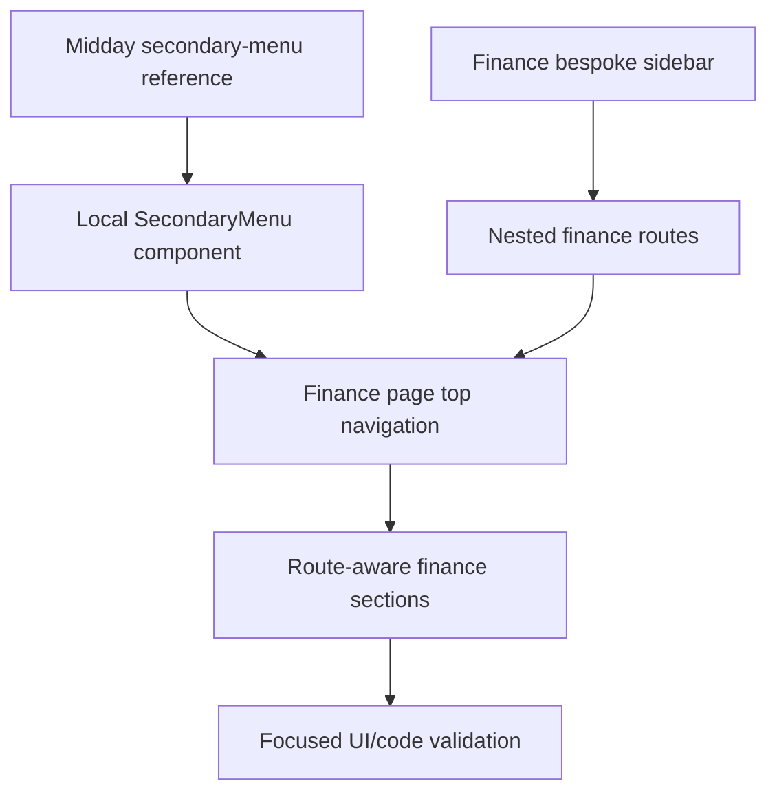

# Plan: Midday Finance Secondary Menu

## Type

Feature

## Status

Done

## Created Date

2026-06-21

## Last Updated

2026-06-21

## Goal Or Problem

Upgrade the finance settings page navigation so the page no longer feels like a giant pile of features. The finance page should use the Midday dashboard `SecondaryMenu` and settings layout pattern, with each major finance entity moved to its own nested subpage.

## Current Context

The finance setup page already has many sections for overview, start date, shares, charges, business profit, migration workbench, legacy loans, and finalization review. A previous implementation used a dense grouped sidebar card inside `apps/dashboard/src/components/tenant-finance-page-view.tsx`. The user requested the Midday pattern from `/Users/M1PRO/Documents/code/_kitchen_sink/midday/apps/dashboard/src/components/secondary-menu.tsx` and `/Users/M1PRO/Documents/code/_kitchen_sink/midday/apps/dashboard/src/app/[locale]/(app)/(sidebar)/settings/layout.tsx`, then clarified that each entity should live on its own subpage such as `/settings/finance/loan`, `/settings/finance/charges`, and `/settings/finance/business`.

## Proposed Approach

Add a local dashboard `SecondaryMenu` component that follows Midday's component structure and replace the finance page's bespoke grouped sidebar with a simple secondary menu above the finance content. Extract the existing finance route loader into a reusable route component, create nested finance subpages, and make `TenantFinancePageView` render only the selected entity section.

## Visual Plan

## Implementation Steps

- Read the Midday `secondary-menu` component and settings layout reference.
- Add `apps/dashboard/src/components/secondary-menu.tsx` with the Midday-style API and active pathname behavior.
- Extract the finance route loader into `settings/finance/finance-route.tsx`.
- Add nested routes for overview, shares, charges, business, loan, and migration.
- Replace the finance page's custom grouped sidebar with `SecondaryMenu`.
- Make the finance view render only the selected subpage section.
- Run focused validation on the changed files.

## Affected Files Or Areas

- `apps/dashboard/src/components/secondary-menu.tsx`
- `apps/dashboard/src/components/tenant-finance-page-view.tsx`
- `apps/dashboard/src/components/initial-migration-preview.tsx`
- `apps/dashboard/src/app/(app)/(sidebar)/settings/finance/**/page.tsx`
- `apps/dashboard/src/app/(app)/(sidebar)/settings/finance/finance-route.tsx`
- `brain/tasks/done.md`

## Acceptance Criteria

- Finance settings renders a Midday-style secondary menu above the finance content.
- The custom grouped finance sidebar card is removed from the page.
- Finance entities are reachable through real nested routes.
- Existing finance setup, charge, share, business, and migration content remains present.
- `/settings/finance/loan` focuses on legacy loan setup.

## Test Plan

- Run a focused static/hygiene check on the changed files.
- Defer browser QA until the user unpends browser testing.

## Risks / Edge Cases

- Anchor links use the Midday component's path-based active state, so only the base finance route is actively underlined until section-level routing or hash-aware active state is intentionally added.
- Some finance tables are wider than Midday's compact settings example, so table-level overflow behavior must carry dense content inside the Midday-width settings layout.
- The first route split reuses the same loader for all finance subpages, so future optimization may load narrower data per subpage.

## Open Questions

- TODO: Decide whether future finance subsections should become real nested settings routes instead of same-page anchors.

## Linked Task

- Task Title: Add Midday Finance Secondary Menu
- Task File: brain/tasks/done.md
