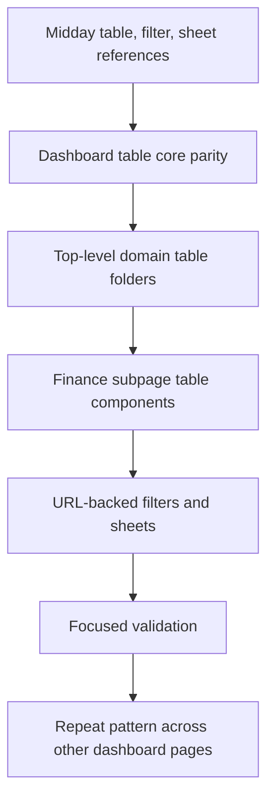

# Plan: Midday Table Filter Sheet Refactor

## Type

Feature

## Status

In Progress

## Created Date

2026-06-21

## Last Updated

2026-07-15

## Goal Or Problem

Refactor finance settings and future dashboard pages to use the Midday table, filter, and sheet architecture exactly as the reference project does. Finance is the first rollout area, and each finance subpage should use domain-owned table folders with columns, headers, empty states, and sheet-based create/edit flows instead of large inline table markup. Forms must not live inline on finance pages; create/edit flows belong in sheets or modals.

Progress on 2026-06-21: shares, charges, and business now have standalone route/page composition, entity headers, URL-backed filter hooks, sheet params hooks, sheet-based create/edit/update flows, and top-level `components/tables/<entity>` folders. Browser QA remains deferred by user instruction.

Progress on 2026-07-14: the main `/business` workspace removed its remaining inline profit-history form and now opens the same create-business history flow from the business header through the URL-backed business sheet, keeping the page aligned with the members page summary/header/table anatomy. The business page was then rebuilt further toward the Midday invoices pattern: server-prefetched tRPC list/setup/summary data, a query-backed virtual table, URL-backed filters/sort/sheet modes, a dedicated open button, `business-sheet-header.tsx`, `business-content.tsx`, `business/form-context.tsx`, row actions menu, column visibility, and selected-row bottom bar are now required parts of the business table architecture rather than optional follow-up work.

Progress on 2026-07-15: the dashboard sidebar now keeps active nested settings/import groups expanded when users land directly on subroutes, and finance setup/imports include explicit overview sublinks so nested navigation mirrors the Midday expandable-sidebar contract. Support, procurement, and foodstuff purchase also use more domain-specific lucide icons instead of generic placeholders.

Progress later on 2026-07-15: the remaining standalone member-create trigger used by the initial migration overview moved from local open state to a URL-backed `createMemberSheet` param, keeping controlled guarantor creation intact. Public password reset, member signup, signup verification, and awaiting-approval routes now share a split `PublicAuthShell` so the public auth/signup surfaces follow the same structural pattern instead of one-off oversized cards.

Progress style cleanup on 2026-07-15: the stale-pattern scan for native/static tables, old modal imports, oversized arbitrary radius cards, and negative tracking headings now only reports permitted `AlertDialog` confirmation gates. Large-radius wrappers were normalized across member, finance, settings, import, signup-link, membership approval, member statement, and topbar surfaces without changing their form actions.

Progress route split cleanup on 2026-07-15: `/domains` now delegates visible domain stats and hostname cards to `domains-view.tsx`, and import settings now delegates its secondary menu, overview readiness cards, blocker summaries, import header, and table handoff to `imports-settings-view.tsx`. The route files keep server-only data loading, permission checks, migration readiness calculations, and hydration setup.

Progress continued route split cleanup on 2026-07-15: cooperative profile, workspace roles, trust readiness, operation profile, notifications, member signup links, membership approvals list/detail, first-run onboarding, members, and the reports audit detail route now use dedicated view components for visible page UI. The related route files keep search-param loading, auth/access fallbacks, server data loading, tRPC hydration where needed, and compact data-to-view handoff responsibilities.

Progress sheet-location cleanup on 2026-07-15: member import, standalone member create, post-create backfill prompt, member signup link, member backfill action, member backfill baseline edit, and initial migration action sheet shells now live under `components/sheets`, while their headers, content routers, and form contexts stay in dedicated ownership files to keep member and migration workflows aligned with the Midday shell/header/content split.

Progress style cleanup follow-up on 2026-07-15: dashboard app and component class names no longer use Tailwind `tracking-*` utilities, keeping headings, labels, table helper text, and shell chrome aligned with the zero-letter-spacing UI rule.

Progress finance navigation cleanup on 2026-07-15: finance settings secondary navigation now uses a shared `financeMenuItems` source across overview, shares, charges, business, and profit-migration routes, reducing menu drift while those pages continue converging on the Midday table/filter/sheet architecture.

Progress operational route split cleanup on 2026-07-15: procurement, Foodstuff Purchase, support, payment receipts, project financing, member share self-service, and guarantor approvals now use dedicated page-view components for state-specific shells, empty states, and member/staff handoff. Their route files now load params/data and delegate rendering.

Progress finance business route split on 2026-07-15: finance business settings now delegates the visible policy summary, edit action, secondary menu, and tenant finance settings sheet to `finance-business-settings-view.tsx`; the route keeps params, runtime, tenant name, and policy loading.

Progress access-state route split on 2026-07-15: member signup links, reports, trust readiness, and operation profile settings now delegate their access/runtime empty states to their view components, further reducing route-owned shell UI while keeping route files focused on data and permission decisions.

Progress finance/approval access-state split on 2026-07-15: loans, repayments, operational charges, contributions, membership approvals list/detail, and audit report routes now also delegate runtime/access empty states to their page-view components, keeping route files focused on params, data loading, and tRPC hydration.

Progress settings/member access-state split on 2026-07-15: workspace roles, member detail, member backfill, and first-run onboarding routes now delegate unavailable/access empty states to their page-view components, continuing the route/data versus view/shell split.

Progress route shell scan cleanup on 2026-07-15: monthly records and getting-started routes now delegate unavailable/access empty states to their page-view components as well. The sidebar route scan no longer finds route-level `WorkspacePageShell` or `WorkspaceEmptyState` usage.

Progress finance settings route-view split on 2026-07-15: finance share settings, charge settings, and business profit migration now delegate visible secondary menu/title/table-or-worksheet handoff to dedicated view components, leaving those finance route files focused on data mapping and hydration.

Progress form-ownership cleanup on 2026-07-15: monthly records moved its year filter form into `monthly-record-year-control.tsx`, and public password reset plus awaiting-approval routes moved their literal form markup into shared public auth form components. Route/page scans now find no route-owned `<form>` elements and no page-view-owned forms; remaining form action hits are component props or non-form section actions.

Progress procurement table migration on 2026-07-15: the staff `/procurement` workspace now uses a shared Midday-style table surface instead of rendering procurement requests as page cards. The route loads persisted `procurement` table settings, the staff view renders a procurement header with column visibility and the URL-backed create action, and `components/tables/procurement/*` owns TanStack columns, draggable/resizable headers, sticky request/action columns, virtual rows, row selection, empty state, and row-click review/purchase sheet routing while preserving the existing procurement sheet workflows.

Progress Foodstuff Purchase table migration on 2026-07-15: the staff `/food-purchase` applications queue now uses a shared Midday-style table surface instead of application cards. The route loads persisted `foodPurchase` table settings, the staff view renders a Foodstuff Purchase header with column visibility and the URL-backed application action, and `components/tables/food-purchase/*` owns TanStack columns, draggable/resizable headers, sticky application/action columns, virtual rows, row selection, empty state, and row-click application review sheet routing while keeping monthly cycle cards as operational summaries.

Progress project financing table migration on 2026-07-15: the staff `/project-financing` request queue now uses a shared Midday-style table surface instead of request cards. The route loads persisted `projectFinancing` table settings, the staff view renders a project financing header with column visibility and the URL-backed create action, and `components/tables/project-financing/*` owns TanStack columns, draggable/resizable headers, sticky request/action columns, virtual rows, row selection, empty state, and row-click review/disbursement sheet routing while preserving existing project financing sheet workflows.

Progress support cases table migration on 2026-07-15: the staff `/support` case queue now uses a shared Midday-style table surface instead of support case cards. The route loads persisted `support` table settings, the staff view renders a support header with column visibility and the URL-backed create action, and `components/tables/support/*` owns TanStack columns, draggable/resizable headers, sticky case/action columns, virtual rows, row selection, empty state, and row-click update sheet routing. Support action cells preserve update, reply, and finance-adjustment review sheet entry points while member support history remains card-based for now.

Progress payment receipts table migration on 2026-07-15: the staff `/payment-receipts` review queue now uses a shared Midday-style table surface instead of receipt cards. The route loads persisted `paymentReceipts` table settings, the staff view renders a payment receipt header with column visibility and the URL-backed stage-receipt action, and `components/tables/payment-receipts/*` owns TanStack columns, draggable/resizable headers, sticky receipt/action columns, virtual rows, row selection, empty state, and row-click review/support sheet routing while member receipt history remains card-based for now.

## Current Context

The finance settings area has been split into nested routes under `/settings/finance`, but the visible tables are still rendered inline inside `apps/dashboard/src/components/tenant-finance-page-view.tsx` and `apps/dashboard/src/components/initial-migration-preview.tsx`. The local table primitives in `apps/dashboard/src/components/tables/core` are lighter than Midday's TanStack-table based pattern. Midday references inspected include `apps/dashboard/src/app/[locale]/(app)/(sidebar)/invoices/page.tsx`, `components/invoice-header.tsx`, `components/invoice-search-filter.tsx`, `components/sheets/invoice-sheet.tsx`, `hooks/use-invoice-params.ts`, `hooks/use-invoice-filter-params.ts`, and `components/tables/invoices/*`.

## Proposed Approach

Port the Midday table shape into this dashboard incrementally. Add TanStack React Table to the dashboard package, extend the local table core with Midday-compatible exports, create top-level domain table folders such as `components/tables/shares` and `components/tables/charges`, and move each finance page into an invoice-style page/header/search-filter/sheet/table/hooks bundle. Use sheets or modals for every create/edit form where the page currently exposes large inline forms. Keep DB/server actions unchanged during the UI refactor unless a subpage needs narrower route data later.

## Visual Plan

## Implementation Steps

- Add missing Midday table dependency and table-core exports where needed.
- Introduce one params hook and one filter params hook per finance entity.
- Refactor the finance shares page to use `components/share-header.tsx`, `components/share-search-filter.tsx`, `components/sheets/share-sheet.tsx`, `hooks/use-share-params.ts`, `hooks/use-share-filter-params.ts`, and `components/tables/shares/*`.
- Apply the same pattern to finance charges, business, loan, and migration tables in later slices.
- Move every finance create/edit form into a sheet or modal as each entity is refactored.
- Preserve existing server actions while UI structure changes.
- Run focused formatting and hygiene checks on changed files.

### Completed In This Slice

- Added Midday-style share, charge, and business entity pages.
- Added `share-*`, `charge-*`, and `business-*` headers/search filters/sheets/hooks.
- Added top-level table folders under `components/tables/shares`, `components/tables/charges`, and `components/tables/business`.
- Moved share, charge, and business create/edit/update interactions into sheets instead of page/table inline forms.
- Moved the remaining `/business` operational profit-history creation form into the business sheet header action.
- Rebuilt `/business` to use tRPC `business.list`, `business.setup`, `business.summary`, and `business.get` instead of passing a static rows array through the page.
- Split the business sheet into the Midday-style sheet wrapper, sheet header, content router, form context, and dedicated open button files.
- Rebuilt the business table around virtual rows, sticky columns, DnD/resizing, persisted column visibility/order/sizing, row actions menu, row click details, and selected-row CSV export bottom bar.
- Kept existing server actions and historical setup lock behavior intact.
- Extended the same Midday-style table runtime to share applications and member-facing procurement, Foodstuff Purchase, project financing, support, and payment receipt histories while preserving their existing URL-backed sheet workflows and member-safe actions.
- Added `trpc.paymentReceipts.list/get` for API-backed infinite payment receipt table loading and selected receipt sheet hydration, with member-role requests forced to the signed-in member profile.
- Added `trpc.procurement.list/get` for API-backed infinite procurement table loading, URL search/status filters, and selected review/purchase sheet hydration, with member-role requests forced to the signed-in member profile.
- Added `trpc.foodPurchase.list/get` for API-backed infinite Foodstuff Purchase application table loading, URL search/status filters, and selected application review sheet hydration, with member-role requests forced to the signed-in member profile.
- Added `trpc.projectFinancing.list/get` for API-backed infinite project financing table loading, URL search/status filters, and selected review/disbursement sheet hydration, with member-role requests forced to the signed-in member profile.
- Added `trpc.shareApplications.list/get` for API-backed infinite additional share application table loading, dedicated URL search/status filters, and selected review sheet hydration, with member-role requests forced to the signed-in member profile.
- Added `trpc.support.list/get` for API-backed infinite support case table loading, URL search/status/priority filters, and selected update/reply/financial-adjustment sheet hydration, with member-role requests forced to the signed-in member profile.

## Affected Files Or Areas

- `apps/dashboard/package.json`
- `bun.lock`
- `apps/dashboard/src/components/tables/core`
- `apps/dashboard/src/components/*-header.tsx`
- `apps/dashboard/src/components/*-search-filter.tsx`
- `apps/dashboard/src/components/tables/<entity>`
- `apps/dashboard/src/components/<entity>-content.tsx`
- `apps/dashboard/src/components/<entity>-sheet-header.tsx`
- `apps/dashboard/src/components/<entity>/form-context.tsx`
- `apps/dashboard/src/components/open-<entity>-sheet.tsx`
- `apps/dashboard/src/components/sheets`
- `apps/dashboard/src/hooks`
- `apps/api/src/routers/<entity>.route.ts`
- `apps/api/src/schemas/<entity>.ts`
- `packages/db/src/queries`
- `apps/dashboard/src/components/tenant-finance-page-view.tsx`
- `apps/dashboard/src/components/initial-migration-preview.tsx`

## Acceptance Criteria

- Finance subpages use Midday-style page/header/filter/sheet/table/hook files instead of large inline page markup.
- Finance tables use TanStack React Table columns and headers.
- Table pages that need row details or create/edit flows include the full Midday sheet split: open button, sheet wrapper, sheet header, content router, and form context.
- Filters are visible in table headers and use URL state when they affect route-level state.
- Create/edit experiences move toward sheet-based flows rather than expanded inline forms.
- No finance table lives under `components/tables/finance/...`.
- The implementation establishes a reusable pattern for later dashboard pages.

## Test Plan

- Run focused Prettier checks on changed UI files.
- Run `git diff --check` and trailing whitespace scans on changed files.
- Defer browser QA until the user unpends browser testing.

## Risks / Edge Cases

- Exact Midday parity may require several slices because current finance pages use server actions and inline forms rather than tRPC mutations.
- Existing historical setup lock behavior must continue to disable mutation paths after migration/backfill starts.
- Some finance pages have multiple related tables; moving all of them in one pass may be too large for a safe single edit.

## Open Questions

- TODO: Decide whether finance create/edit sheets should remain server-action forms short-term or move to a tRPC mutation layer during the larger refactor.
- TODO: Decide whether every finance subpage should get narrower route data loaders before the wider dashboard refactor.

## Linked Task

- Task Title: Refactor Finance Tables To Midday Pattern
- Task File: brain/tasks/in-progress.md
