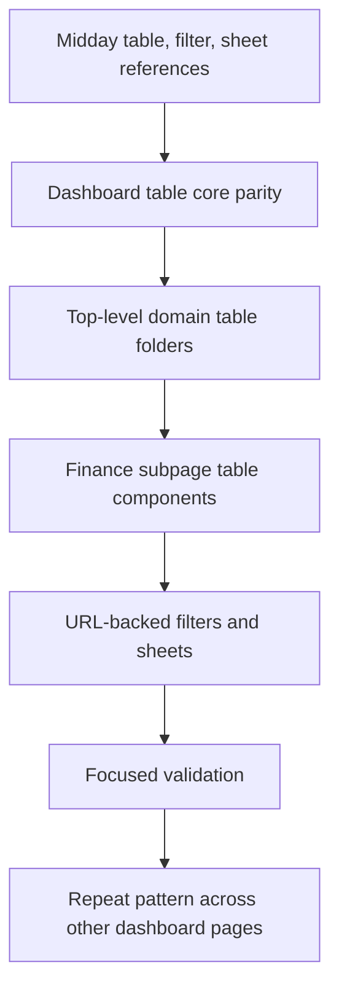

# Plan: Midday Table Filter Sheet Refactor

## Type

Feature

## Status

In Progress

## Created Date

2026-06-21

## Last Updated

2026-06-21

## Goal Or Problem

Refactor finance settings and future dashboard pages to use the Midday table, filter, and sheet architecture exactly as the reference project does. Finance is the first rollout area, and each finance subpage should use domain-owned table folders with columns, headers, empty states, and sheet-based create/edit flows instead of large inline table markup. Forms must not live inline on finance pages; create/edit flows belong in sheets or modals.

Progress on 2026-06-21: shares, charges, and business now have standalone route/page composition, entity headers, URL-backed filter hooks, sheet params hooks, sheet-based create/edit/update flows, and top-level `components/tables/<entity>` folders. Browser QA remains deferred by user instruction.

## Current Context

The finance settings area has been split into nested routes under `/settings/finance`, but the visible tables are still rendered inline inside `apps/dashboard/src/components/tenant-finance-page-view.tsx` and `apps/dashboard/src/components/initial-migration-preview.tsx`. The local table primitives in `apps/dashboard/src/components/tables/core` are lighter than Midday's TanStack-table based pattern. Midday references inspected include `apps/dashboard/src/app/[locale]/(app)/(sidebar)/invoices/page.tsx`, `components/invoice-header.tsx`, `components/invoice-search-filter.tsx`, `components/sheets/invoice-sheet.tsx`, `hooks/use-invoice-params.ts`, `hooks/use-invoice-filter-params.ts`, and `components/tables/invoices/*`.

## Proposed Approach

Port the Midday table shape into this dashboard incrementally. Add TanStack React Table to the dashboard package, extend the local table core with Midday-compatible exports, create top-level domain table folders such as `components/tables/shares` and `components/tables/charges`, and move each finance page into an invoice-style page/header/search-filter/sheet/table/hooks bundle. Use sheets or modals for every create/edit form where the page currently exposes large inline forms. Keep DB/server actions unchanged during the UI refactor unless a subpage needs narrower route data later.

## Visual Plan

## Implementation Steps

- Add missing Midday table dependency and table-core exports where needed.
- Introduce one params hook and one filter params hook per finance entity.
- Refactor the finance shares page to use `components/share-header.tsx`, `components/share-search-filter.tsx`, `components/sheets/share-sheet.tsx`, `hooks/use-share-params.ts`, `hooks/use-share-filter-params.ts`, and `components/tables/shares/*`.
- Apply the same pattern to finance charges, business, loan, and migration tables in later slices.
- Move every finance create/edit form into a sheet or modal as each entity is refactored.
- Preserve existing server actions while UI structure changes.
- Run focused formatting and hygiene checks on changed files.

### Completed In This Slice

- Added Midday-style share, charge, and business entity pages.
- Added `share-*`, `charge-*`, and `business-*` headers/search filters/sheets/hooks.
- Added top-level table folders under `components/tables/shares`, `components/tables/charges`, and `components/tables/business`.
- Moved share, charge, and business create/edit/update interactions into sheets instead of page/table inline forms.
- Kept existing server actions and historical setup lock behavior intact.

## Affected Files Or Areas

- `apps/dashboard/package.json`
- `bun.lock`
- `apps/dashboard/src/components/tables/core`
- `apps/dashboard/src/components/*-header.tsx`
- `apps/dashboard/src/components/*-search-filter.tsx`
- `apps/dashboard/src/components/tables/<entity>`
- `apps/dashboard/src/components/sheets`
- `apps/dashboard/src/hooks`
- `apps/dashboard/src/components/tenant-finance-page-view.tsx`
- `apps/dashboard/src/components/initial-migration-preview.tsx`

## Acceptance Criteria

- Finance subpages use Midday-style page/header/filter/sheet/table/hook files instead of large inline page markup.
- Finance tables use TanStack React Table columns and headers.
- Filters are visible in table headers and use URL state when they affect route-level state.
- Create/edit experiences move toward sheet-based flows rather than expanded inline forms.
- No finance table lives under `components/tables/finance/...`.
- The implementation establishes a reusable pattern for later dashboard pages.

## Test Plan

- Run focused Prettier checks on changed UI files.
- Run `git diff --check` and trailing whitespace scans on changed files.
- Defer browser QA until the user unpends browser testing.

## Risks / Edge Cases

- Exact Midday parity may require several slices because current finance pages use server actions and inline forms rather than tRPC mutations.
- Existing historical setup lock behavior must continue to disable mutation paths after migration/backfill starts.
- Some finance pages have multiple related tables; moving all of them in one pass may be too large for a safe single edit.

## Open Questions

- TODO: Decide whether finance create/edit sheets should remain server-action forms short-term or move to a tRPC mutation layer during the larger refactor.
- TODO: Decide whether every finance subpage should get narrower route data loaders before the wider dashboard refactor.

## Linked Task

- Task Title: Refactor Finance Tables To Midday Pattern
- Task File: brain/tasks/in-progress.md
