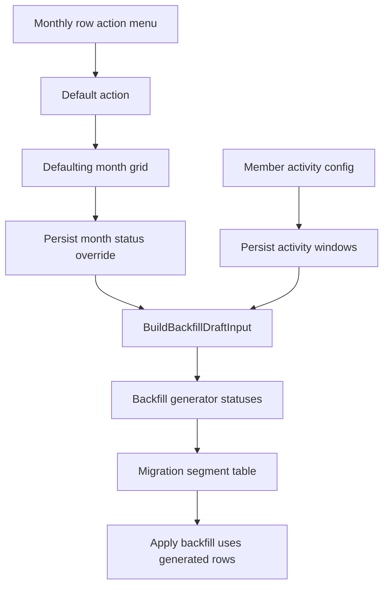

# Plan: Member Defaulting And Activity Windows

## Type
Feature

## Status
Proposed

## Created Date
2026-06-23

## Last Updated
2026-06-23

## Goal Or Problem
Admins need to mark a member as defaulting for one or more historical migration months so those months do not create normal commitments. They also need a member activity configuration that can mark inactive windows, causing migration commitments to pause until the member becomes active again.

## Current Context
The member migration preview already supports manual savings and loan repayment edits through the monthly row action menu in `apps/dashboard/src/components/migration/member-ledger-backfill-table.tsx`.

Backfill projection already has month status concepts in `packages/backfill/src/types.ts`:
- `BackfillMonthStatus = "active" | "missed" | "paused" | "adjusted"`
- `BackfillRowAdjustment` currently stores only `savingsContribution`, `loanRepaymentAmount`, `loanRepaymentOnTime`, and `notes`.

The persisted migration adjustment table is `MigrationBackfillAdjustment` in `packages/db/prisma/models/backfill.prisma`. It does not currently store row status or defaulting state, so using `savingsContribution = 0` alone would be ambiguous and hard to audit.

The member model in `packages/db/prisma/models/member.prisma` has only current `status` and `exitedAt`. That is not enough for historical active/inactive windows where a member can become inactive and later active again.

## Proposed Approach
Persist defaulting and inactive months as explicit monthly status data, then feed that status into the existing backfill generator and migration preview. Do not encode defaulting only as a zero savings override.

Use two related concepts:
- Manual defaulting months: stored on `MigrationBackfillAdjustment` as a row/month status override, likely `missed`, with optional notes.
- Member activity windows: stored in a new activity history model that records active/inactive status by effective month. Projection derives inactive months as `paused`.

Monthly migration rows should show the computed status/reason and use it to calculate commitments:
- `active`: normal generated commitment.
- `adjusted`: normal month with saved savings/loan override.
- `missed`: defaulting month; generated commitment is zero for that month.
- `paused`: inactive month; generated commitment is zero until a later active window resumes commitment.

The row action menu should add a `Default` action. Clicking it opens a focused defaulting month form that renders all migration months in a compact `grid-cols-6` month grid. Toggling months updates the saved defaulting status, revalidates `/settings/finance/migration/[memberId]`, and refreshes the table.

Member configuration should add an activity section for active/inactive effective months. Prefer an activity history/timeline over a single `lastActiveMonth` field, because the user explicitly needs commitment to continue when the member is marked active again.

## Visual Plan

## Implementation Steps
- Add persistence for defaulting month status:
  - Extend `MigrationBackfillAdjustment` with a nullable row status field, for example `rowStatus`.
  - Allow `missed` for manual defaulting and keep existing amount fields unchanged.
  - Update Prisma migration, generated client, and adjustment query/action validation.
- Add persistence for member activity windows:
  - Add a new model such as `MemberActivityWindow` or `MemberActivityEvent`.
  - Suggested fields: `tenantId`, `memberId`, `effectiveMonth`, `status`, `reason`, `notes`, `createdByUserId`, timestamps.
  - Enforce one status event per member/month.
  - Keep `Member.status` as the current operational status, but do not rely on it as the full historical timeline.
- Update the backfill input query in `packages/db/src/queries/backfill.ts`:
  - Map saved adjustment `rowStatus` into `BackfillRowAdjustment`.
  - Load member activity windows for the generated month range.
  - Derive inactive months as `paused`, with manual `missed` defaulting taking precedence where both exist.
- Update `packages/backfill/src/types.ts` and `packages/backfill/src/generator.ts`:
  - Extend `BackfillRowAdjustment` with a status override.
  - Ensure missed/defaulting rows produce zero savings commitment and zero loan repayment for the month unless a future requirement separates savings default from loan repayment default.
  - Ensure paused/inactive rows produce zero commitment and carry an inactive reason.
  - Preserve running totals so skipped months do not add savings, charges, shares, or repayments.
- Update `apps/dashboard/src/components/migration/member-ledger-backfill-table.tsx`:
  - Add `Default` to the existing row action menu.
  - Open a defaulting month form/sheet/dialog with all months in `grid-cols-6`.
  - Toggle selected months between normal and defaulting.
  - Show row status/reasons clearly in the compact table without making the page noisy.
- Add member activity configuration UI:
  - Place it in member configuration/edit flow rather than the migration preview table.
  - Provide "inactive from month" and "active again from month" controls backed by the activity event model.
  - Show a compact activity timeline for auditability.
- Update server actions:
  - Add an action to bulk save defaulting months for one member.
  - Add actions to create/update/remove activity events.
  - Revalidate member migration and member config paths after mutations.
- Update apply/backfill persistence:
  - Confirm `applyBackfill` respects `missed` and `paused` rows and does not post contribution, charge, share, or repayment history for skipped months.
  - Persist applied month status so final history remains explainable.

## Affected Files Or Areas
- `packages/db/prisma/models/backfill.prisma`
- `packages/db/prisma/models/member.prisma`
- `packages/db/src/queries/migration-backfill-adjustments.ts`
- `packages/db/src/queries/backfill.ts`
- `packages/backfill/src/types.ts`
- `packages/backfill/src/generator.ts`
- `apps/dashboard/src/lib/dashboard-actions.ts`
- `apps/dashboard/src/components/migration/member-ledger-backfill-table.tsx`
- Member edit/config components under `apps/dashboard/src/components/forms/` and/or `apps/dashboard/src/components/modals/`
- Tests under `packages/backfill/src/` and `packages/db/src/queries/`

## Acceptance Criteria
- A migration row action menu includes `Default`.
- Clicking `Default` opens a month grid for the selected member.
- The month grid shows all generated migration months and uses a six-column grid on desktop.
- Toggling a month as defaulting marks that month as missed/defaulting after save.
- Defaulting months do not add savings, charges, share capital, loan repayment, or final saving for that month.
- Migration preview clearly shows defaulting months as skipped/defaulting.
- Member configuration can record inactive and active-again effective months.
- Inactive months auto-fill as inactive/paused in migration preview.
- When the member is marked active again from a later month, generated commitments continue from that month.
- Manual defaulting and activity windows are preserved after page refresh.
- Applying migration history respects skipped months.

## Test Plan
- Unit test: a saved row status adjustment of `missed` produces zero commitment values for that month.
- Unit test: inactive activity window from March through May produces paused rows for March, April, and May.
- Unit test: inactive in March and active again in June resumes normal commitments in June.
- Unit test: manual defaulting takes precedence over active member status for the same month.
- Query test: `MigrationBackfillAdjustment.rowStatus` maps into `BuildBackfillDraftInput.rowAdjustments`.
- Query test: member activity events produce expected active/paused month status ranges.
- UI test/manual: open `/settings/finance/migration/[memberId]`, click a month action, choose `Default`, toggle several months, save, and confirm table recalculates.
- UI test/manual: configure member inactive/active months, return to migration preview, and confirm skipped inactive months are shown correctly.
- Apply test: applied history does not create contribution, charge, share, or repayment records for missed/paused months.

## Risks / Edge Cases
- If a month is defaulting while a loan is active, the current proposal treats the whole commitment as missed, including loan repayment. TODO: Confirm whether loan repayment can still be paid when savings commitment is missed.
- If inactive windows overlap manual savings/loan adjustments, explicit defaulting/inactive status should win over amount edits. TODO: Confirm whether admins need an override to force a value in inactive months.
- A single `lastActiveMonth` field cannot model inactive then active again; the plan uses activity events instead.
- This requires a DB migration because new persisted status/activity data is needed.
- `bun run db:migrate` and `bun run db:push` should only run during implementation after schema changes are actually made.

## Open Questions
- TODO: Should defaulting zero both savings and loan repayment, or only savings commitment?
- TODO: Should inactive months show as `paused` while manual defaulting months show as `missed`, or should both display as `defaulting` in the UI?
- TODO: Should admins be able to remove activity events after migration is finalized, or should they be locked like other migration inputs?

## Linked Task
- Task Title: Member Defaulting And Activity Windows
- Task File: brain/tasks/roadmap.md
