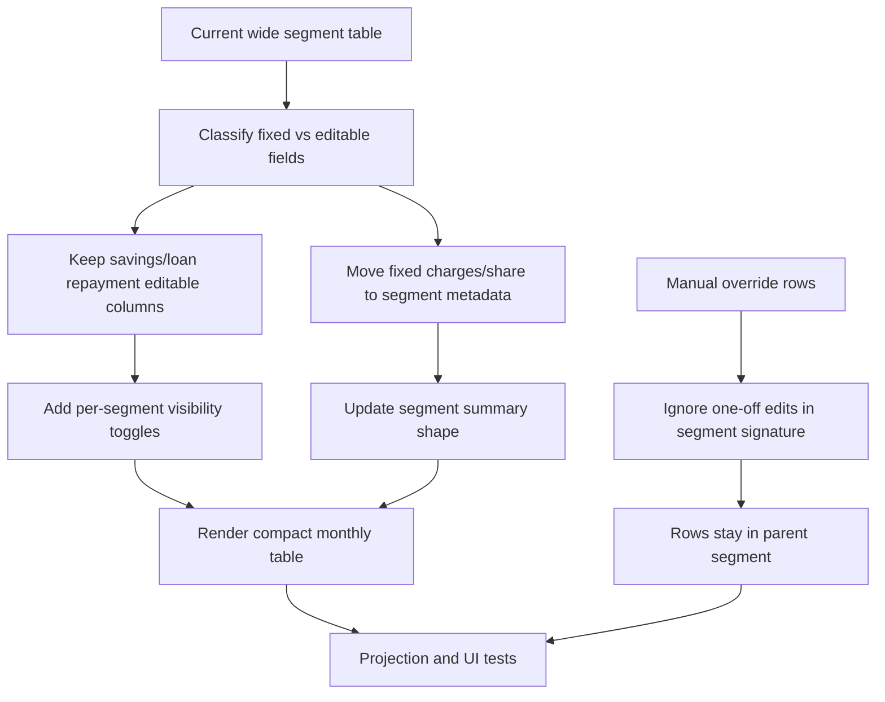

# Plan: Migration Segment Column Reduction And Manual Override Grouping

## Type
Feature

## Status
Proposed

## Created Date
2026-06-23

## Last Updated
2026-06-23

## Goal Or Problem
The member migration segment table is still horizontally dense because fixed per-segment values, such as stamp duty and share capital, are rendered as full table columns on every row. Admins need a tighter preview that keeps editable values visible while moving fixed segment values into the segment label/header area.

Admins also need manual one-off saving or loan repayment edits to stay inside their current segment instead of causing a separate segment split. A manual edit should be a row-level exception, not a continuous effective-date change.

## Current Context
The member ledger table is rendered in `apps/dashboard/src/components/migration/member-ledger-backfill-table.tsx`.

Projection and grouping live in `packages/backfill/src/migration.ts`:
- `getProjectedRowSignature` currently includes `isEdited`, `loanService`, and `savingsContribution`.
- Because signatures drive segment boundaries, a one-off manual edit can split the row into its own segment.
- `groupRowsByEffectiveDateSegment` currently exposes `summary.chargeLabels` and row charge/share values, and the table renders charge and share capital as columns.

Manual row edit controls are already passed into the table as `renderSavingsControl` and `renderRepaymentControl`, so the UI can keep those editable columns and add display toggles without changing persistence.

## Proposed Approach
Reduce the monthly segment table columns by moving fixed segment-level deductions and share capital values out of the row grid and into compact segment metadata above the table.

Keep the row grid focused on values admins may need to inspect or edit:
- Period
- Loan repayment columns, when applicable
- Savings column
- Total share value
- Final saving
- Loan balance columns, when applicable
- Total saving
- Action

Add checkbox toggles in the segment label area:
- `Show savings column`
- `Show loan repayment column`, only when the segment has loan repayment columns

The toggles hide or show the corresponding table columns for scanning. However, if any row in that segment has a manual savings override, the savings toggle must be checked and disabled. If any row in that segment has a manual loan repayment override, the loan repayment toggle must be checked and disabled. This prevents hiding values that need review.

Change segment grouping so row-level manual overrides do not create new segments:
- Remove `isEdited` from the segment signature.
- Treat manual `savingsContribution` and `loanService` drift as row-level annotations, not segment-defining fields.
- Keep segment breaks for true continuous rule changes, such as charge schedules, share capital rules, loan start/end context, defaulting/inactive status, business profit events, and loan-taken event boundaries.

## Visual Plan

## Implementation Steps
- Update the projected segment model in `packages/backfill/src/types.ts`:
  - Add fixed-value metadata to `MonthlyLedgerSegment.summary`, such as charge labels/ranges and share capital ranges.
  - Add booleans for whether savings or repayment columns are required because a manual override exists.
- Update `packages/backfill/src/migration.ts`:
  - Remove one-off manual edit fields from the segment signature.
  - Keep continuous rule fields in the signature.
  - Preserve row-level `isEdited` and status labels so manual edits still show in the row.
  - Compute segment-level labels for fixed deductions and share capital.
- Update `MemberLedgerBackfillTable`:
  - Move stamp duty/charge and share capital values to a compact metadata row above each monthly segment table.
  - Add `Show savings column` and `Show loan repayment column` checkbox controls in the segment label/metadata area.
  - Hide/show savings and repayment columns based on local component state per segment.
  - Auto-check and disable the savings toggle when any row has a manual savings override.
  - Auto-check and disable the repayment toggle when any row has a manual repayment override.
  - Keep manual edit actions in the row action menu even if a column is hidden, unless the forced-visible rule applies.
- Update tests in `packages/backfill/src/migration.test.ts`:
  - A one-off savings edit should not create a separate monthly segment.
  - A one-off loan repayment edit should not create a separate monthly segment.
  - Charge/share changes should still create segment breaks.
  - Segment summary should expose fixed charge/share metadata.
- Add or update UI-level/manual verification:
  - Open `/settings/finance/migration/[memberId]`.
  - Confirm stamp duty and share capital are no longer full monthly row columns.
  - Confirm they appear after the segment title/label as fixed metadata.
  - Toggle savings column visibility.
  - Toggle loan repayment visibility on a segment with loans.
  - Confirm toggles are forced on and disabled when a row has a manual edit.

## Affected Files Or Areas
- `packages/backfill/src/types.ts`
- `packages/backfill/src/migration.ts`
- `packages/backfill/src/migration.test.ts`
- `apps/dashboard/src/components/migration/member-ledger-backfill-table.tsx`
- `apps/dashboard/src/components/initial-migration-preview.tsx`

## Acceptance Criteria
- Monthly segment tables no longer render fixed stamp duty/charge columns as repeated row columns.
- Monthly segment tables no longer render fixed share capital contribution as a repeated row column.
- Segment label/metadata shows fixed charges and share capital values for the segment.
- Savings column can be shown/hidden per segment.
- Loan repayment columns can be shown/hidden per segment when loans exist.
- Savings toggle is checked and disabled when any row in that segment has a manual savings edit.
- Loan repayment toggle is checked and disabled when any row in that segment has a manual loan repayment edit.
- Manual savings or loan repayment edits do not split a month into a separate segment.
- True continuous rule changes still split segments.
- Profit and loan-taken standalone segment ordering remains unchanged.

## Test Plan
- Projection test: manual savings edit in February keeps January-March in one monthly segment when no continuous rule changes exist.
- Projection test: manual loan repayment edit in February keeps the loan repayment period in one monthly segment.
- Projection test: charge amount change still creates a new segment.
- Projection test: share capital rule change still creates a new segment.
- UI/manual: verify fixed values appear in segment metadata and editable columns can be toggled.
- UI/manual: verify a segment with edited savings or edited repayment forces the relevant column visible.

## Risks / Edge Cases
- If a segment has mixed charge values, the metadata should show a range or concise per-charge summary instead of pretending the value is fixed.
- If a segment has multiple active loans, the repayment toggle should hide/show all repayment columns together unless the UI later needs per-loan toggles.
- If savings is hidden, row actions must still make it possible to edit savings from the action menu.
- Removing manual edits from the segment signature could hide important row exceptions unless the row still displays an override marker.

## Open Questions
- TODO: Should fixed metadata show exact value only when uniform and a range when values differ, or should the segment split before values differ?
- TODO: Should loan repayment visibility be one checkbox for all repayment columns or one checkbox per loan when multiple loans exist?
- TODO: Should the savings/repayment visibility preference persist per user, or is local page state enough for now?

## Linked Task
- Task Title: Migration Segment Column Reduction And Manual Override Grouping
- Task File: brain/tasks/roadmap.md
