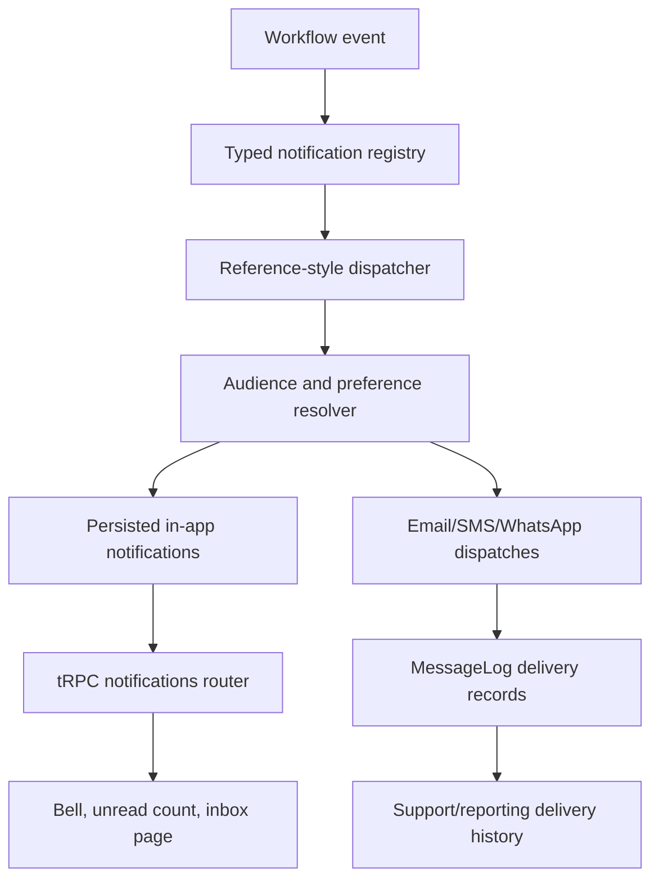

# Plan: Reference-Style Notification Dispatcher, Inbox, And Message Logs

## Type
Feature

## Status
In Progress

## Created Date
2026-06-23

## Last Updated
2026-06-27

## Goal Or Problem
Migrate HalaalVest notifications to the same product shape used by the local `gnd`, `school-clerk`, and `after-service` projects: typed notification definitions, shared email templates, immediate or task-triggered dispatch, persisted in-app notifications, unread/read dashboard behavior, preference-aware routing, and delivery message logs. Do not build or preserve the `notification-outbox-deliver` feature as the target architecture.

## Explicit Non-Goal
- Do not add a worker that claims queued notification outbox rows and drains them later.
- Do not use `NotificationOutbox` as the primary notification architecture for new workflow notifications.
- Do not make dashboard notification UX revolve around queued/outbox delivery-worker health.
- Do not keep plan language that tells future agents to implement `notification-outbox-deliver`.

## Reference Behavior To Match
- `gnd`: typed handler registry, channel trigger helpers, `Notifications.create(...)`, Trigger task named `notification`, channel subscribers, React Email templates, Resend service, and activity records.
- `school-clerk`: typed `createNotificationFromType(...)`, `dispatchSchoolNotification(...)`, persisted `Notification`, `NotificationRecipient`, `NotificationContact`, unread count, mark-read APIs, notification bell, and full notifications page.
- `after-service`: small `Notifications.send(...)` service, task-triggered notification payloads, direct dispatch controlled by `sendEmail`, and `messageLog` delivery records.

## Current Context
- `packages/notifications/src/types/registry.ts` already has a useful typed HalaalVest notification catalog.
- `packages/email` already exists and should remain the React Email boundary instead of moving React rendering into the notification core.
- `packages/notifications-react` currently provides transient toast behavior, but no persisted notification bell or inbox.
- `packages/db/prisma/models/notification.prisma` currently has `NotificationOutbox` and role-level `NotificationPreference`, but no reference-style persisted in-app notification model.
- `packages/db/src/queries/notifications.ts` currently creates outbox entries, updates outbox delivery status, lists delivery history, updates preferences, and queues role-based email outbox entries.
- `packages/jobs/src/handlers/notification-outbox-deliver.ts` and `packages/jobs/src/tasks/notification-outbox-deliver.task.ts` are the wrong target for this feature and should be retired or replaced.
- `apps/api/src/routers/notifications.route.ts` currently returns sample notifications instead of persisted user notifications.
- `apps/dashboard/src/app/(app)/(sidebar)/notifications/page.tsx` currently presents delivery history and queued/sent/failed outbox status instead of a user-facing inbox.

## Proposed Architecture
Use the notification registry as the single source of type truth, then route each workflow event through a dispatcher that:

1. Validates payload against the notification type schema.
2. Builds in-app title/body/action/link from the same definition used for email content.
3. Resolves tenant users, role audiences, direct recipients, and optional channel subscribers.
4. Applies per-user notification preferences with default-enabled semantics.
5. Persists in-app notification rows for recipients.
6. Sends email immediately for synchronous flows, or through a `notification` Trigger/local background task for async flows.
7. Writes a message log for every attempted external delivery.

`NotificationOutbox` may remain temporarily for legacy signup history and existing data, but new workflow paths should move to persisted notifications plus message logs.

## Visual Plan

## Migration Checklist

### Phase 1: Remove The Wrong Target From The Plan
- [ ] Remove `notification-outbox-deliver` as a target feature from Brain docs.
- [ ] Mark current outbox-drain job files as retirement candidates, not implementation targets.
- [ ] Replace dashboard copy that describes queued delivery worker health with inbox/message-log language in the plan.
- [ ] Confirm future implementation steps point to dispatcher, inbox, and message logs.

### Phase 2: Database Model Migration
- [ ] Add `NotificationVisibility`, `NotificationRecipientStatus`, and `NotificationContactRole` enums.
- [ ] Add `Notification` with tenant, user, author contact, type, title, body, subject, content, link, action JSON, read status, visibility, and soft-delete fields.
- [ ] Add `NotificationRecipient` with notification/contact relation, unread/read/archived status, read timestamp, and uniqueness per notification/contact.
- [ ] Add `NotificationContact` for user/staff/member-facing recipient identity inside a tenant.
- [ ] Add `NotificationTag` for type and workflow metadata.
- [ ] Add user-level or contact-level `NotificationPreference` with `inApp` and `email` booleans, modeled after `school-clerk`.
- [ ] Add `MessageLog` or `NotificationDeliveryLog` with tenant, channel, recipient, subject, body, provider, provider id, status, error details, metadata, and sent timestamp, modeled after `after-service`.
- [ ] Decide whether `NotificationOutbox` stays as legacy history, is renamed later, or is removed in a cleanup migration.

### Phase 3: Notification Package Reshape
- [ ] Keep and harden `halaalVestNotificationTypes` as the source of notification type truth.
- [ ] Add reference-style handler contracts: schema, activity/in-app builder, email builder, optional WhatsApp builder, and default channels.
- [ ] Add `createNotificationFromType(type, payload)` that returns title, body, action, link, channels, email template metadata, and variant.
- [ ] Add `Notifications` service with a `send(...)` or `create(...)` method matching the `gnd`/`after-service` shape.
- [ ] Add payload-utils for author resolution, recipient normalization, role audiences, channel triggers, absolute tenant dashboard links, and test recipient handling.
- [ ] Keep email rendering in `packages/email`; use `@halaalvest/notifications` for data contracts and builders only.

### Phase 4: Dispatcher And Query Layer
- [ ] Replace `queueTenantRoleNotifications(...)` with `dispatchTenantRoleNotification(...)`.
- [ ] Add `dispatchTenantNotification(...)` for direct user/email/member recipients.
- [ ] Add `ensureNotificationContact(...)`.
- [ ] Add `listUserNotifications(...)`.
- [ ] Add `getUnreadNotificationCount(...)`.
- [ ] Add `markNotificationRead(...)`.
- [ ] Add `markAllNotificationsRead(...)`.
- [ ] Add `upsertUserNotificationPreference(...)`.
- [ ] Add `createMessageLog(...)` and provider-result normalization.
- [ ] Preserve tenant scoping on every read and mutation.

### Phase 5: Jobs And Async Dispatch
- [ ] Delete or stop exporting `packages/jobs/src/handlers/notification-outbox-deliver.ts`.
- [ ] Delete or stop exporting `packages/jobs/src/tasks/notification-outbox-deliver.task.ts`.
- [ ] Add `packages/jobs/src/tasks/notification.task.ts` with payload `{ type, tenantId, payload, channels, sendEmail, recipients?, author? }`.
- [ ] Have the task call `new Notifications(db).send(...)`.
- [ ] Keep local `triggerJob(...)` fallback, but use it to run a notification dispatch task rather than drain queued outbox rows.
- [ ] Keep an `email-smoke-test` task if useful, but write to message logs rather than creating an outbox row.

### Phase 6: Workflow Producer Migration
- [ ] `apps/web/app/api/signup/route.ts`: replace outbox queue/trigger with direct signup verification send; production failure should block signup.
- [ ] `apps/web/app/api/onboarding/route.ts`: send workspace-ready email directly; failure should remain non-blocking and be logged.
- [ ] `apps/dashboard/src/app/auth/password-reset/request/route.ts`: send password reset directly and log the outcome.
- [ ] `apps/dashboard/src/lib/public-actions.ts`: move member signup verification notifications to the dispatcher.
- [ ] `apps/dashboard/src/lib/dashboard-actions.ts`: replace outbox creation and role queueing with typed dispatcher calls for approvals, KYC, monthly records, charges, loans, repayments, domains, collections, imports, migration, and share profit events.
- [ ] `apps/api/src/routers/members.route.ts`: replace `queueTenantRoleNotifications(...)` with dispatcher usage.
- [ ] Guard against double sends while each producer is migrated.

### Phase 7: API And React UI
- [ ] Replace sample data in `apps/api/src/routers/notifications.route.ts` with persisted list, unread count, mark read, mark all read, and preference procedures.
- [ ] Add or adapt a notification bell in dashboard layout, modeled after `school-clerk`.
- [ ] Rebuild `/notifications` as an inbox with all/unread filters, action links, relative timestamps, type badges, and mark-read actions.
- [ ] Move external delivery history to support/reporting views backed by message logs.
- [ ] Update `packages/notifications-react` only for reusable presentation pieces; keep app-specific tRPC wiring in dashboard if that fits the local architecture better.

### Phase 8: Email Templates
- [ ] Expand `packages/email` with shared shell, logo/header, footer, button, detail table, amount card, warning block, and metadata rows.
- [ ] Add onboarding, auth, member lifecycle, finance, loan, collections, domain, import, migration, and share profit templates.
- [ ] Add render helpers for jobs/routes.
- [ ] Add test-recipient override behavior and skipped-email behavior similar to `gnd` and `after-service`.
- [ ] Ensure templates can produce both HTML and readable text/body content for logs.

### Phase 9: Reporting And Legacy Cleanup
- [ ] Update notification reports/export routes to read message logs for external delivery history.
- [ ] Keep legacy outbox reports only if needed for historical signup/onboarding audit data.
- [ ] Remove queued-worker health cards from the dashboard notifications page.
- [ ] Document the legacy `notification_outbox` status in `brain/database/schema.md` if it remains.

### Phase 10: Verification
- [ ] Search for `notificationOutboxDeliver`, `notification-outbox-deliver`, `claimNotificationOutboxEntries`, and new producer use of `createNotificationOutboxEntry`.
- [ ] Confirm no new workflow producer depends on outbox-drain behavior.
- [ ] Unit test notification registry builders and dispatcher result handling.
- [ ] Unit test preference filtering and recipient dedupe.
- [ ] DB test notification contacts, recipients, unread counts, mark-read, mark-all-read, and message logs.
- [ ] Route test notification list/unread/read procedures.
- [ ] Flow test signup verification, onboarding workspace-ready, password reset, member approval/rejection, KYC, charges, loans, repayments, collections, imports, and migration events.
- [ ] Because this is a Bun monorepo, prefer targeted package checks during implementation and avoid broad typechecks/builds unless explicitly requested.

## Affected Files Or Areas
- `packages/notifications/src/index.ts`
- `packages/notifications/src/core-types.ts`
- `packages/notifications/src/notification-types.ts`
- `packages/notifications/src/types/**`
- `packages/notifications/src/payload-utils/**`
- `packages/email/**`
- `packages/db/prisma/models/notification.prisma`
- `packages/db/prisma/models/**` for message logs if stored separately
- `packages/db/prisma/migrations/**`
- `packages/db/src/queries/notifications.ts`
- `packages/db/src/queries/audit.ts`
- `packages/jobs/src/tasks/notification.task.ts`
- `packages/jobs/src/tasks/index.ts`
- `packages/jobs/src/index.ts`
- `apps/api/src/routers/notifications.route.ts`
- `apps/api/src/routers/members.route.ts`
- `apps/dashboard/src/lib/dashboard-actions.ts`
- `apps/dashboard/src/lib/public-actions.ts`
- `apps/dashboard/src/app/(app)/(sidebar)/notifications/page.tsx`
- `apps/dashboard/src/app/(app)/(sidebar)/reports/notifications-export/route.ts`
- `apps/dashboard/src/app/auth/password-reset/request/route.ts`
- `apps/web/app/api/signup/route.ts`
- `apps/web/app/api/onboarding/route.ts`
- `apps/web/src/lib/server-notifications.ts`
- `brain/PROJECT_INDEX.md`
- `brain/api/endpoints.md`
- `brain/database/schema.md`

## Acceptance Criteria
- The plan and implementation no longer target `notification-outbox-deliver`.
- A reference-style notification dispatcher exists and is used by workflow producers.
- Persisted in-app notifications support list, unread count, mark read, and mark all read.
- Dashboard has a notification bell and inbox backed by persisted records, not samples.
- External email/SMS/WhatsApp attempts are logged as message delivery records.
- Per-user or per-contact preferences control email and in-app delivery independently.
- Signup verification sends synchronously and blocks in production on delivery failure.
- Workspace-ready email sends directly and logs failures without rolling back tenant creation.
- Existing typed registry coverage is preserved or improved.
- Reports distinguish user notifications from external delivery logs.

## Recommended Verification Commands
- `rg -n "notificationOutboxDeliver|notification-outbox-deliver|claimNotificationOutboxEntries" packages apps brain`
- `rg -n "createNotificationOutboxEntry|queueTenantRoleNotifications" apps packages/db/src packages/jobs/src`
- `bun --filter @halaalvest/notifications test`
- `bun --filter @halaalvest/db test`
- `bun --filter @halaalvest/api test`
- `bun --filter @halaalvest/dashboard test`

Do not run broad builds or monorepo-wide typechecks by default during this migration unless explicitly requested.

## Risks And Mitigations
- Double sends during migration: migrate producers one at a time and search for mixed outbox/dispatcher usage before marking each complete.
- Lost delivery auditability: introduce message logs before removing outbox-dependent screens.
- Tenant privacy leaks: scope notification list and mark-read mutations by tenant and recipient contact.
- Preference mismatch: default missing preferences to enabled and create explicit false rows only when a user disables a channel.
- Signup regressions: keep signup verification production behavior fail-closed.
- Email template coupling: keep React Email inside `packages/email`, not the notification core.
- Legacy outbox confusion: label it legacy in docs and avoid using it for new workflow notifications.

## Open Questions
- Should `NotificationPreference` be per user, per notification contact, or both?
- Should member-facing public notifications share the same `NotificationContact` table as staff/admin users?
- Should SMS/WhatsApp be schema-ready now, or limited to email and in-app until provider choices are final?
- Should old `notification_outbox` rows be migrated into message logs, retained as legacy history, or dropped after a data-retention decision?

## Linked Task
- Task Title: School-Clerk-Style Notification Email And Job Implementation
- Task File: brain/tasks/in-progress.md
