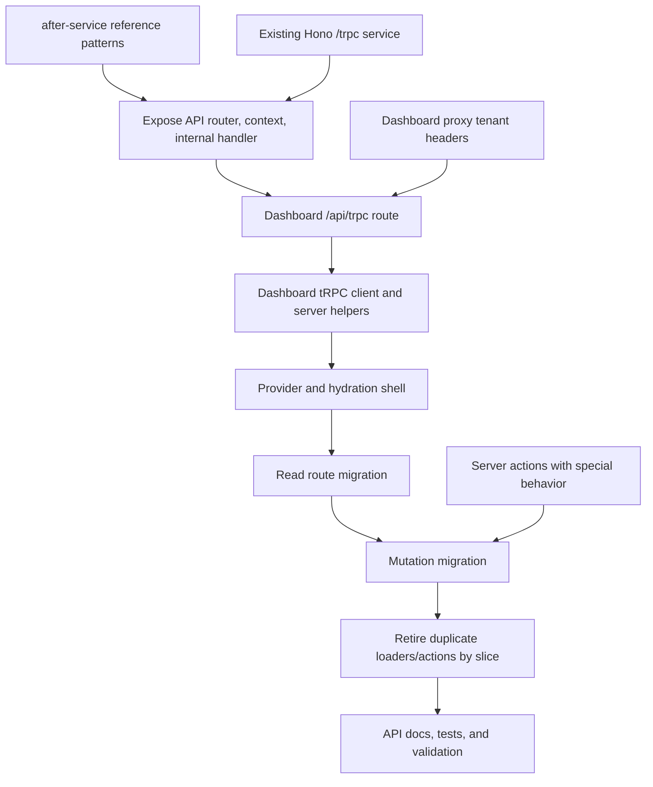

# Plan: After-Service tRPC Route Implementation And Usage Migration

## Type
Feature

## Status
Proposed

## Created Date
2026-06-26

## Last Updated
2026-06-26

## Goal Or Problem
Implement the dashboard tRPC route and usage layer correctly using the local `after-service` project as the reference pattern, then migrate dashboard data loading and mutations from mixed direct DB loaders/server actions toward typed tRPC usage without breaking tenant isolation, session handling, existing forms, or cache invalidation behavior.

## Current Context
The repository already has a Hono + tRPC API foundation:

- `apps/api/src/index.ts` serves `appRouter` at `/trpc/*` through `fetchRequestHandler`.
- `apps/api/src/context.ts` builds request context from trusted headers, scoped session cookies, tenant host/subdomain headers, user lookup, membership lookup, and DB runtime state.
- `apps/api/src/lib.trpc.ts` defines `publicProcedure`, `authenticatedProcedure`, `tenantProcedure`, and `minRoleProcedure`.
- `apps/api/src/routers/_app.ts` groups existing `health`, `notifications`, `workspace`, `members`, `contributions`, `charges`, `onboarding`, and `filters` routers.
- `apps/dashboard` already depends on `@halaalvest/api`, but `apps/api/package.json` does not expose router/context entrypoints for typed dashboard imports.
- `apps/dashboard` does not yet depend on `@tanstack/react-query`, `@trpc/client`, or `@trpc/tanstack-react-query`; it only uses `@tanstack/react-table`.
- `apps/dashboard/src/app/layout.tsx` currently wraps `NuqsAdapter`, `ThemeProvider`, and `NotificationsProvider`, but no tRPC/React Query provider exists.
- Dashboard routes currently use server-first loaders such as `apps/dashboard/src/lib/members/load-members-page.ts`, `apps/dashboard/src/lib/contributions/load-contributions-page.ts`, and `apps/dashboard/src/lib/loans/load-loans-page.ts`.
- Most writes currently live in the large server-action module `apps/dashboard/src/lib/dashboard-actions.ts`, with role checks, migration/live-write guards, direct DB calls, and `revalidatePath` calls.
- `apps/dashboard/src/proxy.ts` sanitizes client-supplied internal headers and injects trusted tenant URL headers before route handling. Any dashboard tRPC path must preserve this guarantee.
- The local reference `after-service` uses:
  - `apps/api/src/index.ts` for Hono tRPC serving.
  - `apps/api/src/internal-api.ts` for reusable Next route handlers.
  - `apps/api/src/routers/_app.ts` as both router and type export surface.
  - `apps/dashboard/src/app/api/trpc/[...trpc]/route.ts` to re-export API handlers inside the dashboard app.
  - `apps/dashboard/src/trpc/client.tsx`, `server.tsx`, and `query-client.ts` for React Query provider, client hooks, RSC prefetching, hydration, and typed query/mutation options.
  - Server components that call `prefetch(trpc.someRouter.someProcedure.queryOptions(...))` and client components that call `useTRPC()` plus React Query hooks.

## Proposed Approach
Adopt the after-service tRPC shape, but make HalaalVest-specific choices explicit:

1. Keep `apps/api` as the canonical router owner and source of route types.
2. Add API package exports for router, context, and reusable internal route handling so `apps/dashboard` can import typed tRPC utilities without deep relative imports.
3. Add a dashboard-local `/api/trpc/[...trpc]` route that reuses the API handler in-process for dashboard client calls, while keeping the standalone Hono `/trpc/*` service for external/service-to-service access.
4. Add dashboard tRPC client/server helpers based on after-service:
   - `src/trpc/query-client.ts` for one shared QueryClient factory.
   - `src/trpc/client.tsx` for `TRPCReactProvider` and `useTRPC`.
   - `src/trpc/server.tsx` for RSC `trpc`, `prefetch`, `batchPrefetch`, and `HydrateClient`.
5. Preserve tenant/session safety by deriving all tRPC context from request headers/cookies, not input payloads. Dashboard proxy remains responsible for sanitized tenant headers.
6. Migrate usage in thin, reversible slices:
   - First migrate read-only list/detail routes that already have API router coverage.
   - Then migrate client-side mutations for forms that benefit from optimistic state, toastable errors, or sheet/modal UX.
   - Keep server actions temporarily where native form submission, redirects, file uploads, background jobs, or broad `revalidatePath` fan-out are still simpler and safer.
7. As each usage slice migrates, move shared validation and role/guard logic into API routers or shared helpers so server actions and tRPC procedures cannot drift.

## Visual Plan

## Implementation Steps
- Confirm the tRPC dependency set and align versions:
  - Add `@tanstack/react-query`, `@trpc/client`, and `@trpc/tanstack-react-query` to `apps/dashboard`.
  - Add `@trpc/server` to `apps/dashboard` only if type imports or local handler re-exports require it.
  - Keep `superjson` shared between API and dashboard tRPC links.
  - Prefer the after-service `@trpc/tanstack-react-query` options API over the older `@trpc/react-query` wrapper unless implementation testing proves the current tRPC version requires a different package.
- Add public exports to `@halaalvest/api`:
  - `./router` exports `appRouter` and `AppRouter` from `apps/api/src/routers/_app.ts`.
  - `./context` exports `buildRequestContext`, `createTRPCContext`, and `TRPCContext`.
  - `./internal-api` exports reusable `GET` and `POST` handlers for Next route handlers.
  - Keep server boot code in `apps/api/src/index.ts` isolated so importing router/types from dashboard does not start the Hono server.
- Refactor API handler code safely:
  - Extract a `handleTrpcRequest(request: Request, endpoint: "/api/trpc" | "/trpc")` helper or equivalent.
  - Use `fetchRequestHandler` with `router: appRouter`, `createContext: createTRPCContext`, and `endpoint` matching the inbound route.
  - Keep Hono `/trpc/*` support in `apps/api/src/index.ts`.
  - Optionally add `/api/trpc/*` support to Hono if dashboard rewrites or external hosting expects that path.
  - Preserve existing CORS behavior for the standalone API service and do not weaken allowed headers beyond the tenant/session headers already required.
- Add dashboard route wiring:
  - Create `apps/dashboard/src/app/api/trpc/[...trpc]/route.ts`.
  - Re-export `GET` and `POST` from `@halaalvest/api/internal-api`.
  - Set `dynamic = "force-dynamic"` to avoid caching request-scoped tenant/session results.
  - Confirm `apps/dashboard/src/proxy.ts` treats `/api/` as public from a redirect perspective but still sanitizes/injects request headers before route execution.
- Add dashboard tRPC utilities:
  - Create `apps/dashboard/src/trpc/query-client.ts` with a stable QueryClient factory and default query behavior appropriate for dashboard data.
  - Create `apps/dashboard/src/trpc/client.tsx` with:
    - `createTRPCContext<AppRouter>()`
    - `TRPCReactProvider`
    - `useTRPC`
    - `httpBatchStreamLink` or `httpBatchLink` targeting `/api/trpc`
    - `loggerLink` enabled in development and error-downlink cases
    - `superjson` transformer
  - Create `apps/dashboard/src/trpc/server.tsx` with:
    - cached QueryClient creation
    - cached context creation from `next/headers`
    - `createTRPCOptionsProxy<AppRouter>` using in-process `appRouter`
    - `prefetch`, `batchPrefetch`, and `HydrateClient`
  - Avoid duplicating `NuqsAdapter`; either keep it in root layout or move it into the tRPC provider, but not both.
- Wire the provider into `apps/dashboard/src/app/layout.tsx`:
  - Wrap the existing `ThemeProvider` and `NotificationsProvider` with `TRPCReactProvider`, or place the tRPC provider inside the current `NuqsAdapter` if URL state must remain outermost.
  - Verify provider ordering with client components that already use `nuqs`, notifications, and theme.
- Establish migration rules before touching feature routes:
  - Reads that are route/page-scoped and already server-rendered can migrate to RSC prefetch + hydrated client tables only when client interactivity benefits.
  - Server components can call `trpc.router.procedure.queryOptions()` through the server helper for prefetching; direct `appRouter.createCaller` should be reserved for non-React utilities or temporary bridging.
  - Mutations should use tRPC only after their role checks, tenant guards, and domain validation are available in the router.
  - Keep server actions for file uploads, CSV parsing/import staging, redirects, cron routes, and broad job trigger flows until equivalent typed mutation ergonomics are intentionally designed.
- Migrate route usage in this order:
  - `health`, `workspace`, and `onboarding` as smoke tests because they already have small router surfaces.
  - `members.list`, `members.get`, `members.create`, `members.update`, and `members.updateStatus` because the API router exists and members are a clear dashboard route boundary.
  - `contributions.list`, `contributions.record`, `contributions.memberHistory`, and `contributions.memberSavings`.
  - `charges.listDefinitions`, `charges.createDefinition`, `charges.updateDefinition`, `charges.listVersions`, and `charges.createVersion`.
  - `notifications.*` after persisted notification route behavior is implemented, because the current API route still returns sample data.
  - Larger finance/migration/import/loan/repayment flows only after new routers are added and guard behavior matches the existing server actions.
- Implement missing routers before migrating dependent UI:
  - Add route files for `loans`, `repayments`, `monthlyRecords`, `tenantFinance`, `shareBusiness`, `imports`, `domains`, `reports`, and `migration` only as each UI slice is ready to move.
  - Keep each router thin: Zod input validation, role procedure selection, tenant/user context extraction, and calls into `packages/db` query functions.
  - Move repeated guard logic from `dashboard-actions.ts` into shared server helpers or DB/domain functions when both server actions and tRPC procedures need it.
- Update UI usage patterns by slice:
  - For pages, replace loader calls with server prefetch plus `HydrateClient` when the child client table/form will use the same query.
  - For client forms, replace `startTransition(async () => serverAction(formData))` with `useMutation(trpc.router.procedure.mutationOptions(...))`.
  - Replace server-action-only pending state with React Query mutation pending/error state.
  - Replace `revalidatePath` expectations with targeted `queryClient.invalidateQueries(trpc.router.procedure.queryKey(...))`.
  - For mutations that affect multiple pages, provide shared invalidation helpers such as `useDashboardInvalidations`.
  - Keep graceful fallback state for database unavailable cases currently handled in server loaders.
- Define deprecation/cleanup checkpoints:
  - After a route slice is fully migrated, remove unused loader branches and unused server actions for that slice.
  - If an action remains as a compatibility wrapper, make it call the same shared service/helper as the tRPC mutation instead of duplicating business logic.
  - Keep `brain/api/endpoints.md` and `brain/api/contracts.md` aligned after each router addition.
  - Add notes to `brain/system/architecture.md` once the dashboard tRPC usage pattern is established.

## Affected Files Or Areas
- `apps/api/package.json`
- `apps/api/src/index.ts`
- `apps/api/src/context.ts`
- `apps/api/src/routers/_app.ts`
- `apps/api/src/internal-api.ts`
- `apps/api/src/lib.trpc.ts`
- `apps/api/src/routers/*.route.ts`
- `apps/dashboard/package.json`
- `apps/dashboard/next.config.mjs`
- `apps/dashboard/src/app/api/trpc/[...trpc]/route.ts`
- `apps/dashboard/src/app/layout.tsx`
- `apps/dashboard/src/proxy.ts`
- `apps/dashboard/src/trpc/client.tsx`
- `apps/dashboard/src/trpc/server.tsx`
- `apps/dashboard/src/trpc/query-client.ts`
- `apps/dashboard/src/lib/dashboard-actions.ts`
- `apps/dashboard/src/lib/*/load-*-page.ts`
- `apps/dashboard/src/components/forms/**`
- `apps/dashboard/src/components/tables/**`
- `apps/dashboard/src/components/sheets/**`
- `packages/db/src/queries/**`
- `brain/api/endpoints.md`
- `brain/api/contracts.md`
- `brain/api/permissions.md`
- `brain/system/architecture.md`

## Acceptance Criteria
- `@halaalvest/api` exposes stable router, context, and internal handler entrypoints without starting the API server when imported.
- The dashboard app has a working `/api/trpc/[...trpc]` route backed by the shared API router.
- Dashboard client components can call typed tRPC queries and mutations through `useTRPC()` and React Query.
- Dashboard server components can prefetch typed tRPC query options and hydrate client components.
- Tenant context, session context, and role checks continue to derive from trusted request context, not tRPC input payloads.
- Existing Hono `/trpc/*` API behavior continues to work.
- At least one low-risk read path and one mutation path are migrated end-to-end before broader migration proceeds.
- Migrated mutations invalidate the correct query keys and do not rely on broad `revalidatePath` behavior unless a compatibility server action remains.
- Server actions that remain are intentionally documented as temporary or still appropriate for their workflow.
- API endpoint and contract docs reflect the implemented tRPC route surface.

## Test Plan
- Run `bun --filter @halaalvest/api typecheck`.
- Run `bun --filter @halaalvest/dashboard typecheck`.
- Run `bun --filter @halaalvest/api test` for router and context coverage where tests exist.
- Add focused API tests for `createTRPCContext`, tenant procedure authorization, min-role rejection, and at least one migrated mutation.
- Add dashboard component or integration tests for the first migrated query and mutation where existing test setup supports it.
- Start the dashboard and API dev servers, then verify:
  - `/api/trpc/health.summary` works through the dashboard route.
  - `/trpc/health.summary` still works through the API service.
  - A tenant-scoped query receives the same tenant resolution as the corresponding current server loader.
  - A migrated mutation updates data and invalidates/reloads the visible dashboard state.
- Manually check unauthenticated, wrong-role, and cross-tenant scenarios for the first migrated protected routes.

## Risks / Edge Cases
- Importing `appRouter` into dashboard can accidentally pull server boot code if exports are not separated cleanly.
- Dashboard `/api/` paths are public from redirect checks, so context and procedures must remain the real authorization boundary.
- Client-side tRPC mutations may lose `revalidatePath` side effects unless query invalidation is mapped carefully.
- Server actions currently combine validation, role checks, migration locks, job triggers, and cache invalidation; moving only part of that logic into routers can create drift.
- Some forms submit `FormData` and files; those should remain server actions until file-safe tRPC inputs are deliberately designed.
- Hono CORS and dashboard internal route behavior have different trust boundaries; do not copy browser CORS assumptions into the internal route.
- The current `apps/api` tRPC version is `^11.7.1`; after-service uses newer `^11.17.0`, so exact helper APIs must be verified during implementation.

## Open Questions
- TODO: Decide whether dashboard browser calls should standardize on `/api/trpc` only, or whether a Next rewrite to the standalone API `/trpc` should also be supported for deployed environments.
- TODO: Decide the first production migration slice: members, contributions, or charges.
- TODO: Decide whether retained server actions should wrap tRPC callers, shared service helpers, or remain direct DB calls during the transition.
- TODO: Confirm whether `@trpc/tanstack-react-query` works cleanly with the current `@trpc/server` version or whether the route implementation should upgrade tRPC packages first.

## Linked Task
- Task Title: After-Service tRPC Route Implementation And Usage Migration
- Task File: brain/tasks/roadmap.md
