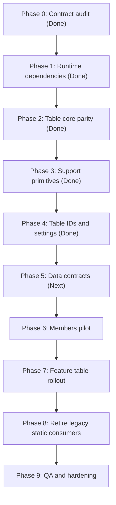

# Plan: Midday Dashboard Table Core Parity

## Type

Feature

## Status

In Progress

## Created Date

2026-06-30

## Last Updated

2026-07-15

## Goal Or Problem

Bring the dashboard table system to full Midday-style parity across all important operational tables, starting with the shared `tables/core` layer and then migrating members and the remaining domain tables onto the same TanStack, persisted settings, URL sort/filter, sticky column, virtualization, and infinite-scroll architecture.

## Current Context

The dashboard already uses a Midday-style `apps/dashboard/src` structure with route-owned pages, domain table folders, and shared dashboard composition helpers. The earlier finance-specific Brain plan, `brain/plans/2026-06-21-feature-midday-table-filter-sheet-refactor.md`, tracks the finance table/filter/sheet rollout.

This plan tracks the broader table-core parity migration requested on 2026-06-30. Phase 0-4 are complete:

- Phase 0 confirmed the current table contract and identified the static table wrappers that had to be kept available for legacy consumers during the migration.
- Phase 1 installed the Midday table runtime dependencies in `apps/dashboard/package.json` and `bun.lock`: `@dnd-kit/core`, `@dnd-kit/sortable`, `@dnd-kit/utilities`, `@tanstack/react-table`, `@tanstack/react-virtual`, `framer-motion`, `react-hotkeys-hook`, `zustand`, `date-fns`, and `lucide-react`.
- Phase 2 restored the advanced Midday-compatible `apps/dashboard/src/components/tables/core` export surface. The transitional legacy static wrappers were later retired after table consumers moved to Midday-style tables or surface-list layouts.
- Phase 3 added the remaining Midday support primitives: table settings persistence, initial settings loading, DnD, horizontal scroll, infinite scroll, sort URL params, scroll-header behavior, draggable headers, resize handles, and horizontal pagination.
- Phase 4 tightened the canonical table settings/config coverage for the planned operational table migration targets, including default hidden columns, sticky columns, sort maps, non-reorderable columns, row heights, and summary heights.
- Table support primitives now exist in `apps/dashboard/src/components/portal.tsx`, `apps/dashboard/src/hooks/use-sticky-columns.ts`, `apps/dashboard/src/utils/table-settings.ts`, `apps/dashboard/src/utils/table-configs.ts`, `apps/dashboard/src/utils/columns.ts`, `apps/dashboard/src/actions/update-table-settings-action.ts`, and the new table behavior hooks/components.

The main member, finance, import, loan, approval, notification, monthly-record, audit, and operational tables now use the shared Midday-style table runtime or intentional non-table surface lists. Audit, notification delivery history, membership approvals, the operational charge library, contribution ledger, loan requests, and loan portfolio now also use hydrated tRPC infinite-query contracts. Remaining table work should focus on query-contract hardening for the older server-fed domains, remaining reporting surfaces beyond audit, and any newly introduced list-heavy routes.

## Proposed Approach

Complete the rollout in staged phases. Keep `tables/core` as the reusable Midday-compatible table atom layer, keep old static wrappers outside `tables/core`, add the remaining support hooks/components, then convert members first as the pilot domain before repeating the pattern across contributions, finance, imports, loans, approvals, notifications, and audit/reporting tables.

Do not migrate every domain table in the same edit. Each table migration should move through schema/query, tRPC/API contract, URL params, columns/header, table body, empty/skeleton/no-results states, and focused validation.

## Visual Plan

## Implementation Steps

### Phase 0: Contract Audit

- Status: Done
- Outcome: Reviewed local table consumers, the previous static `DashboardTable*` exports, and the Midday table reference shape. Confirmed the migration needed a compatibility split instead of deleting old static table APIs.

### Phase 1: Runtime Dependencies

- Status: Done
- Outcome: Added the runtime packages required by Midday table behavior to `apps/dashboard/package.json` and `bun.lock`.

### Phase 2: Replace Tables Core With Midday-Compatible Core

- Status: Done
- Outcome: `apps/dashboard/src/components/tables/core/index.ts` now exposes the advanced core table atoms/types/helpers.
- Outcome: Direct legacy imports from `@/components/tables/core` were removed from the scanned dashboard app/components surface.
- Outcome: The retired `apps/dashboard/src/components/dashboard/static-table.tsx` compatibility module has been removed.

### Phase 3: Add Remaining Midday Support Primitives

- Status: Done
- Outcome: Created the missing server action and hooks that sit around the core table:
  - `apps/dashboard/src/actions/update-table-settings-action.ts`
  - `apps/dashboard/src/hooks/use-table-settings.ts`
  - `apps/dashboard/src/hooks/use-table-dnd.ts`
  - `apps/dashboard/src/hooks/use-table-scroll.ts`
  - `apps/dashboard/src/hooks/use-infinite-scroll.ts`
  - `apps/dashboard/src/hooks/use-sort-params.ts`
  - `apps/dashboard/src/hooks/use-sort-query.ts`
  - `apps/dashboard/src/hooks/use-scroll-header.ts`
- Outcome: Created the missing table helper components:
  - `apps/dashboard/src/components/tables/draggable-header.tsx`
  - `apps/dashboard/src/components/tables/resize-handle.tsx`
  - `apps/dashboard/src/components/horizontal-pagination.tsx`
- Outcome: Added `apps/dashboard/src/utils/columns.ts` for Midday-style initial table settings loading.
- Outcome: Kept Phase 3 scoped to support primitives. The members page conversion remains a later phase.

### Phase 4: Define Canonical Table IDs, Settings, And Config Coverage

- Status: Done
- Outcome: Audited `apps/dashboard/src/utils/table-settings.ts` and `apps/dashboard/src/utils/table-configs.ts` against the current domain table files and route-owned static table surfaces that will migrate.
- Outcome: Kept canonical `TableId` coverage focused on members, contributions, charges, shares, business, imports, loan portfolio, loan requests, membership approvals, notifications, and audit.
- Outcome: Updated sticky columns, non-reorderable columns, sort maps, default hidden columns, row heights, and summary heights so later domain migrations consume a stable config contract.

### Phase 5: Migrate Data Contracts To Midday Query Shape

- Status: In Progress
- Add typed API schemas where table inputs cross app boundaries.
- Move table listing APIs toward Midday-style input contracts: cursor or pagination, page size, search, filters, sort field, sort direction, and table-specific metadata.
- Keep reusable DB logic in `packages/db/src/queries/*`.
- Keep route handlers thin and tenant scoped.

### Phase 6: Members Pilot Table

- Status: Done
- Convert the members page first because it was the original target and has enough filters to prove the pattern.
- Update members list data to support URL filters, sorting, table metadata, persisted settings, sticky columns, no-results/empty states, and row actions through the new core table runtime.
- Keep server-first page composition, but use tRPC hydration/client hooks where Midday's table pattern requires interactive query state.

### Phase 7: Migrate All Feature Tables

- Status: In Progress
- Repeat the proven members pattern across contributions, charges, shares, business, imports, loan portfolio, loan requests, membership approvals, notifications, audit, reports, and any remaining list-heavy dashboard screens.
- Migrate one domain at a time with its columns, header, row actions, empty states, skeleton, filter params, sort params, and query contract.
- Outcome: The audit report route now has its own `tables/audit` implementation with persisted `audit` settings, a hydrated `reports.auditEvents` tRPC infinite query, cursor/page-size/sort/filter input, sortable/draggable/resizable headers, column visibility, virtual rows, and the existing sticky action-column configuration.
- Outcome: Notification delivery history now has a `notifications.deliveryHistory` tRPC infinite-query contract, and the notifications table consumes hydrated delivery pages directly instead of receiving server-mapped row props.
- Outcome: Membership approvals now have an `onboarding.membershipApprovals` tRPC infinite-query contract backed by cursor/sort-capable member onboarding request queries, and the approvals table consumes hydrated request pages directly instead of receiving route-mapped row props.
- Outcome: The operational charge library now has a `charges.chargeLibrary` tRPC infinite-query contract and the charge-library table consumes hydrated charge-definition pages directly, while the route continues to use server charge data for stats and history cards.
- Outcome: Contribution ledger now has a `contributions.ledger` tRPC infinite-query contract backed by cursor/sort-capable contribution queries, and the ledger table consumes hydrated contribution pages directly instead of receiving route-loaded row props.
- Outcome: Loan request and loan portfolio tables now have `loans.requests` and `loans.portfolio` tRPC infinite-query contracts, and both tables consume hydrated pages directly instead of receiving route-loaded item props.
- Outcome: Monthly record member rows now have a `monthlyRecords.rows` tRPC infinite-query contract backed by the existing selected-record detail calculation, and the table consumes hydrated member-row pages directly instead of receiving selected-record rows from the page. The selected-record detail remains server-loaded for monthly stats, charge breakdowns, and the row action sheet.
- Outcome: Finance charge and share history tables now have `charges.financeCharges` and `charges.financeShares` tRPC infinite-query contracts backed by tenant finance setup data. Their tables consume hydrated rows directly, while route-loaded rows remain available for sheet edit context and no-database fallback rendering.
- Outcome: Import batch tables now have an `imports.batches` tRPC infinite-query contract backed by the import batch query. The imports route hydrates section-scoped batches with URL search/status/sort params, while route-loaded batches remain available for overview stats and import sheet context.
- Outcome: Procurement request tables now have a `procurement.list` tRPC infinite-query contract and `procurement.get` detail contract. The route hydrates the first page with URL search/status/sort params, while the sheet resolves URL-selected review/purchase requests independently of the first route-loaded request batch.
- Outcome: Foodstuff Purchase application tables now have a `foodPurchase.list` tRPC infinite-query contract and `foodPurchase.get` detail contract. The route hydrates the first page with URL search/status/sort params, while the sheet resolves URL-selected application reviews independently of the first route-loaded application batch.
- Outcome: Project financing request tables now have a `projectFinancing.list` tRPC infinite-query contract and `projectFinancing.get` detail contract. The route hydrates the first page with URL search/status/sort params, while the sheet resolves URL-selected review/disbursement requests independently of the first route-loaded request batch.
- Outcome: Share application tables now have a `shareApplications.list` tRPC infinite-query contract and `shareApplications.get` detail contract. Finance settings and member self-service routes hydrate the first page with dedicated share-application URL search/status params, while the sheet resolves URL-selected review applications independently of the first route-loaded application batch.
- Outcome: Support case tables now have a `support.list` tRPC infinite-query contract and `support.get` detail contract. The route hydrates the first page with URL search/status/priority/sort params, while the sheet resolves URL-selected update/reply/financial-adjustment cases independently of the first route-loaded case batch.

### Phase 8: Retire Legacy Static Consumers

- Status: Done
- Replaced remaining uses of `apps/dashboard/src/components/dashboard/static-table.tsx` where Midday parity was required.
- Deleted the retired static wrapper module after all consumers moved away from it.
- Ensure `apps/dashboard/src/components/tables/core` remains advanced-table-only.

### Phase 9: QA, Hardening, And Documentation Sync

- Status: Planned
- Run focused lint/typecheck for migrated files and broader dashboard checks when shared contracts change.
- Browser-test desktop and mobile table behavior for sticky columns, resizing, column reordering, keyboard interaction, no-results, empty state, and pagination/infinite loading.
- Update Brain docs after each major domain slice.

## Affected Files Or Areas

- `apps/dashboard/package.json`
- `bun.lock`
- `apps/dashboard/src/components/tables/core/*`
- `apps/dashboard/src/components/tables/<domain>/*`
- `apps/dashboard/src/components/tables/draggable-header.tsx`
- `apps/dashboard/src/components/tables/resize-handle.tsx`
- `apps/dashboard/src/components/horizontal-pagination.tsx`
- `apps/dashboard/src/actions/update-table-settings-action.ts`
- `apps/dashboard/src/hooks/use-table-settings.ts`
- `apps/dashboard/src/hooks/use-table-dnd.ts`
- `apps/dashboard/src/hooks/use-table-scroll.ts`
- `apps/dashboard/src/hooks/use-infinite-scroll.ts`
- `apps/dashboard/src/hooks/use-sort-params.ts`
- `apps/dashboard/src/hooks/use-sort-query.ts`
- `apps/dashboard/src/hooks/use-scroll-header.ts`
- `apps/dashboard/src/hooks/use-members-filter-params.ts`
- `apps/dashboard/src/utils/table-settings.ts`
- `apps/dashboard/src/utils/table-configs.ts`
- `apps/dashboard/src/utils/columns.ts`
- `apps/dashboard/src/trpc/server.tsx`
- `apps/dashboard/src/trpc/client.tsx`
- `apps/api/src/routers/*.route.ts`
- `apps/api/src/schemas/*`
- `packages/db/src/queries/*`
- `brain/plans/2026-06-21-feature-midday-table-filter-sheet-refactor.md`

## Acceptance Criteria

- `apps/dashboard/src/components/tables/core` matches the advanced Midday table-core role and does not export legacy static wrappers.
- All migrated tables use TanStack column definitions, shared Midday-style table primitives, persisted column settings, sortable headers, sticky columns where configured, and domain-owned columns/header/table files.
- Members is completed first and becomes the reference implementation for the rest of the dashboard.
- Every migrated table has intentional empty, no-results, skeleton/loading, pagination or infinite-scroll, filter, sort, and row-action behavior.
- Table data contracts are typed at API boundaries and tenant scoped in DB query modules.
- Brain plan and task status stay current after each phase.

## Test Plan

- Run `git diff --check` after each phase.
- Run focused lint on changed dashboard files, for example `bun run lint -- src/hooks/use-table-settings.ts src/hooks/use-table-dnd.ts src/components/tables/draggable-header.tsx`.
- Run focused dashboard typecheck after shared table contracts change: `bun run typecheck` from `apps/dashboard`.
- For migrated domain tables, verify filter and sort URL params, persisted table settings cookie behavior, sticky columns, reorder/resize interaction, loading states, empty states, and no-results states.
- Browser QA the members pilot before migrating the rest of the feature tables.

## Risks / Edge Cases

- The current dashboard has several static or server-fed tables, so direct Midday parity will require data contract work, not only component replacement.
- Some tables may need cursor-based or metadata-rich DB queries before the UI can match Midday behavior cleanly.
- Persisted column settings must tolerate renamed columns and table-specific defaults.
- Typecheck may be resource-heavy in this workspace; narrow validation should be used while editing, with broader checks before landing.

## Open Questions

- None.

## Linked Task

- Task Title: Port Dashboard Tables To Midday Core Parity
- Task File: brain/tasks/in-progress.md
