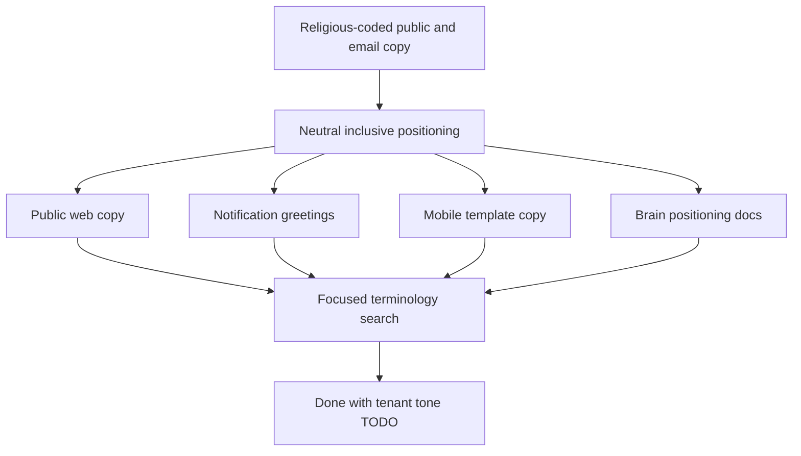

# Plan: Inclusive Interest-Free Cooperative Positioning

## Type
Feature

## Status
Done

## Created Date
2026-07-03

## Last Updated
2026-07-03

## Goal Or Problem
Broaden Halaalvest public positioning so any cooperative operator can understand and use the platform, while preserving the 100% Halaal / interest-free finance model. Remove global religious greetings such as `Assalamu alaikum` from default platform emails.

## Current Context
Halaalvest public copy previously led with phrases such as halal cooperatives, halal savings, and halal cooperative operations platform. Default signup, workspace, invitation, member approval, and password reset emails opened with `Assalamu alaikum`. Brain docs already described Halaalvest as software for cooperatives, thrift societies, and member-owned finance groups, but some product docs still defaulted to religious audience cues and loan/lending terminology.

## Proposed Approach
Use inclusive operator-facing language on public, signup, notification, and mobile surfaces: interest-free, ethical, transparent, cooperative, financing, and member-owned. Keep Halaal as the finance/compliance standard in internal docs and guardrails. Document that explicitly religious tone should become tenant-configurable later rather than the global default.

## Visual Plan

## Implementation Steps
- Replace public marketing copy that implies a Muslim-only audience with interest-free cooperative finance positioning.
- Replace default email greetings with neutral `Hello` greetings.
- Replace `Shariah-aligned` mobile template copy with interest-free cooperative financing language.
- Update Brain product, system, prompt-rule, pricing, and core-platform docs with the inclusive positioning rule.
- Record the remaining tenant-configurable religious-tone setting as future work.

## Affected Files Or Areas
- `apps/web/src/components/marketing/launch-landing.tsx`
- `apps/web/src/components/marketing/prelaunch-landing.tsx`
- `apps/web/app/layout.tsx`
- `packages/notifications/src/types/onboarding.ts`
- `packages/notifications/src/types/member.ts`
- `apps/dashboard/src/app/auth/password-reset/request/route.ts`
- `apps/mobile/src/data/mobile-template.ts`
- `brain/AI_PROMPT_RULES.md`
- `brain/product/halaal-cooperative-operating-model.md`
- `brain/product/vision.md`
- `brain/features/core-cooperative-platform.md`
- `brain/product/pricing-and-packaging.md`
- `brain/SYSTEM_OVERVIEW.md`
- `brain/BRAIN.md`
- `README.md`

## Acceptance Criteria
- Public marketing metadata and landing copy describe Halaalvest as an interest-free cooperative operations platform, not as a product only for halal cooperatives.
- Default signup, onboarding, invitation, membership, and password reset emails do not use Islamic greetings.
- Mobile template copy avoids `Shariah-aligned` as the default broad product phrase.
- Brain docs preserve the Halaal / interest-free finance guardrails while documenting inclusive public communication rules.
- Remaining religious or Halaal terms are limited to brand names, finance guardrails, internal docs, or future tenant-configurable choices.

## Test Plan
- Run a focused terminology search for `Assalamu`, `alaikum`, `halal`, `Halal`, `Shariah`, `Sharia`, `Muslim`, and `Halaal`.
- Run focused lint/type checks for changed app and notification packages when practical.
- Review diffs to confirm the changes do not alter finance logic, tenant scoping, auth behavior, or existing unrelated worktree edits.

## Risks / Edge Cases
- Some dashboard, route, schema, and migration surfaces still use `loan` terminology because renaming the full finance module is larger than this positioning pass.
- The `Halaalvest` brand itself remains religiously suggestive; this plan intentionally broadens copy without renaming the product.
- TODO: Add tenant-configurable communication tone so a cooperative can opt into Islamic greetings or other local greetings later.

## Open Questions
- TODO: Should the product eventually expose a tenant setting for greeting style and religious/compliance terminology?
- TODO: Should the dashboard finance module be relabeled from loans to financing across routes, tables, imports, and schema-facing copy in a separate migration-safe pass?

## Linked Task
- Task Title: Inclusive Interest-Free Cooperative Positioning
- Task File: brain/tasks/done.md
