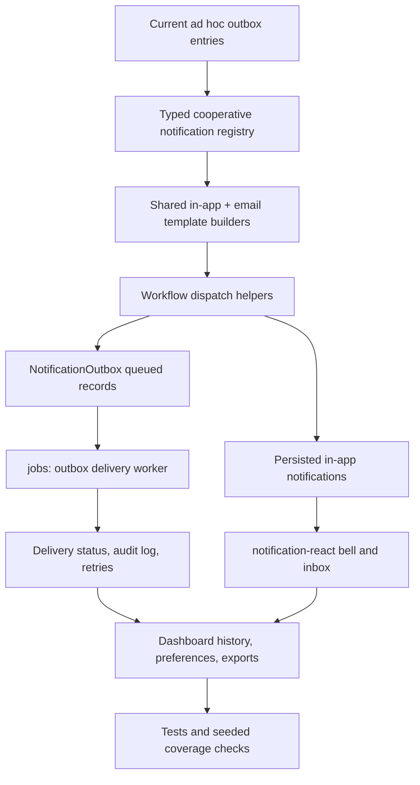

# Plan: School-Clerk-Style Notification Email And Job Implementation

## Type
Feature

## Status
In Progress

## Created Date
2026-06-23

## Last Updated
2026-06-23

## Goal Or Problem
Implement a complete notification system for HalaalVest using the local `school-clerk` repository as the reference pattern: typed notification definitions, matching email templates, in-app notification rendering, durable outbox delivery, background jobs, preference-aware routing, and dashboard visibility for all cooperative workflows that currently queue or should queue notifications.

## Current Context
The current app already has the base pieces but they are not wired into a complete implementation:

- `packages/notifications/src/index.ts` defines simple notification inputs, an in-memory store, email transport primitives, Resend delivery, retries, and two email draft builders: `signup_email_verification` and `workspace_ready`.
- `packages/notifications-react/src/provider.tsx` renders toast-style client notifications through a provider, but there is no persisted notification bell, unread state, action routing, or dashboard inbox equivalent.
- `packages/db/prisma/models/notification.prisma` has durable `NotificationOutbox` and `NotificationPreference` models, but no persisted in-app notification model yet.
- `packages/db/src/queries/notifications.ts` can create outbox entries, update delivery status, list delivery history, update preferences, and queue role-based email outbox entries.
- `packages/jobs/src/queue.ts` and `packages/jobs/src/trigger.ts` provide local background execution and retry fallback, while existing tasks cover backfill and monthly record generation.
- `apps/dashboard/src/lib/dashboard-actions.ts`, `apps/dashboard/src/lib/public-actions.ts`, `apps/web/app/api/signup/route.ts`, and `apps/web/app/api/onboarding/route.ts` already create notification outbox entries for many workflows, but those entries are inconsistent strings rather than typed templates and most dashboard-created entries are not delivered by a worker.
- `apps/dashboard/src/app/(app)/(sidebar)/notifications/page.tsx` shows delivery history and preference toggles, but its managed notification type list is manually curated and incomplete.
- `apps/api/src/routers/notifications.route.ts` currently returns sample notifications instead of persisted user notifications.
- `school-clerk` reference patterns inspected:
  - `/Users/M1PRO/Documents/code/school-clerk/packages/notifications/src/types/registry.ts`
  - `/Users/M1PRO/Documents/code/school-clerk/packages/notifications/src/types/shared.ts`
  - `/Users/M1PRO/Documents/code/school-clerk/apps/api/src/lib/notifications.ts`
  - `/Users/M1PRO/Documents/code/school-clerk/apps/api/src/trpc/routers/notifications.routes.ts`
  - `/Users/M1PRO/Documents/code/school-clerk/apps/dashboard/src/components/notifications/notification-bell.tsx`
  - `/Users/M1PRO/Documents/code/school-clerk/apps/dashboard/src/components/notifications/notifications-page.tsx`
  - `/Users/M1PRO/Documents/code/school-clerk/packages/email/emails/finance-notification.tsx`

The school-clerk shape to adapt is: define typed notification payload schemas, build in-app content and email template content from the same definition, dispatch to role audiences with preference checks, persist in-app records, send email, and expose unread/read dashboard routes.

## Proposed Approach
Add a typed notification catalog to `@halaalvest/notifications`, add a React email template layer, route all workflow notifications through shared builders, and add a job-backed outbox delivery worker. Keep the existing `NotificationOutbox` as the delivery ledger, add persisted in-app notification storage if product scope requires unread/read behavior, and update `@halaalvest/notifications-react` plus dashboard/API routes to show real notifications instead of samples.

Implementation should be staged:

1. Introduce shared notification definitions that mirror school-clerk's registry pattern but use cooperative domain language.
2. Add reusable email templates and builders for onboarding, membership, finance, loan, repayment, domain, migration, import, and collection events.
3. Replace ad hoc outbox entry creation in dashboard/web flows with typed `createNotificationFromType(...)` or `createEmailDraftFromType(...)` helpers.
4. Add a notification delivery job that claims queued outbox entries, sends with `NotificationService`, updates status, retries safely, and records audit metadata.
5. Expand React notification UI from toast-only behavior to persisted notification bell/inbox behavior once the DB model and API endpoints exist.
6. Update the notifications dashboard to derive managed type coverage from the registry, preview every template, and show delivery/job health.

## Visual Plan

## Implementation Steps
- Add a school-clerk-style registry in `packages/notifications/src/`:
  - `core-types.ts` for variants, channels, actions, recipients, and delivery metadata.
  - `notification-types.ts` with `defineNotificationTypes` and typed `createNotificationFromType`.
  - `types/shared.ts` for cooperative base schemas and common helpers.
  - `types/registry.ts` as the single exported source of notification type truth.
  - `payload-utils/` for audience helpers, recipient normalization, absolute dashboard links, and channel-specific trigger helpers.
- Create the complete initial cooperative notification catalog:
  - `signup.email_verification`: primary contact verifies pre-tenant signup email.
  - `workspace.ready`: primary contact receives dashboard and site links after tenant bootstrap.
  - `workspace.invitation`: staff/admin invitation to join a cooperative workspace.
  - `member.onboarding_verification_requested`: public member signup email verification.
  - `member.onboarding_approved`: applicant membership approved.
  - `member.onboarding_rejected`: applicant membership rejected or needs follow-up.
  - `member.status_changed`: member active, suspended, inactive, exited, or pending status changed.
  - `member.kyc_updated`: member KYC review status changed.
  - `monthly_record.generated`: scheduled monthly records generated.
  - `monthly_record.member_applied`: member monthly record payment applied.
  - `monthly_record.member_cancelled`: member monthly record payment cancelled/reversed.
  - `contribution.recorded`: contribution posted for a member.
  - `contribution.plan_changed`: member contribution commitment changed or closed.
  - `charge.applied`: charge posted to a member.
  - `charge.waived`: charge waived.
  - `charge.reversed`: charge reversed.
  - `loan.request_submitted`: loan request submitted and needs review.
  - `loan.request_status_changed`: loan request approved, rejected, or under review.
  - `loan.disbursed`: loan disbursed.
  - `repayment.posted`: repayment posted.
  - `collections.follow_up_recorded`: collection follow-up recorded.
  - `domain.verification_changed`: manual domain verification status changed.
  - `domain.verification_checked`: DNS/domain check completed.
  - `import.completed`: import batch completed.
  - `import.failed`: import batch failed or needs correction.
  - `migration.backfill_initialized`: historical member ledger backfill initialized.
  - `migration.backfill_applied`: historical member ledger backfill applied.
  - `share.profit_published`: share/business profit allocations published.
- Add a React email package or email submodule:
  - Preferred: create `packages/email` to match school-clerk's boundary and keep React Email dependencies out of the non-React notification core.
  - Add shared components: shell, logo/header, footer, button, detail table, amount card, warning block.
  - Add templates: onboarding email, member lifecycle email, finance event email, loan event email, domain event email, import/migration job email, and collection follow-up email.
  - Export render helpers so server routes/jobs can convert templates to HTML.
- Extend `packages/notifications` email support:
  - Keep `NotificationEmailDraft` for transport compatibility.
  - Add typed `buildEmailDraftFromType(type, payload)` and `buildNotificationRecordFromType(type, payload)` helpers.
  - Add subject, preview text, body text, action label, action URL, recipient/audience, and template metadata per type.
  - Keep console and Resend transports, but make provider result parsing stable and testable.
- Update DB notification persistence:
  - Keep `NotificationOutbox` for email delivery history.
  - Add migration for persisted in-app notifications if unread/read bell behavior is in scope:
    - `Notification`
    - `NotificationRecipient`
    - optional tag or metadata relation as JSON for type/action data.
  - Add indexes for `tenantId`, `userId`, `status`, `notificationType`, and `createdAt`.
  - Add query helpers for creating in-app notifications, listing user notifications, unread count, mark read, mark all read, and archiving/dismissing.
- Refactor `packages/db/src/queries/notifications.ts`:
  - Add `queueNotificationFromType` and `queueTenantRoleNotificationFromType`.
  - Resolve role audiences through `listTenantUsersWithMemberships`.
  - Respect `NotificationPreference` for email and, if added, in-app channel separately.
  - Deduplicate recipients by email/user ID.
  - Persist outbox entries with normalized metadata and absolute action URLs.
  - Add a claim/update API for queued outbox delivery: claim limited batch, mark running if a status is added, mark sent/failed, increment attempts, and preserve last error.
- Add jobs implementation in `packages/jobs`:
  - `tasks/notification-outbox-deliver.task.ts`.
  - `handlers/notification-outbox-deliver.ts`.
  - Optional scheduled task entry for recurring processing.
  - Handler flow: claim queued entries, build draft from persisted data, send through server notification service, update outbox status, record audit logs, and stop retrying after max attempts.
  - Trigger the delivery job after queueing high-priority notifications, and expose a cron/API route for periodic catch-up if Trigger.dev is not configured.
- Update workflow producers:
  - Replace literal notification strings in `apps/dashboard/src/lib/dashboard-actions.ts` with typed notification helpers.
  - Replace route-time signup/workspace email builders in `apps/web/app/api/signup/route.ts` and `apps/web/app/api/onboarding/route.ts` with typed builders while keeping signup verification failure blocking and workspace-ready failure non-blocking.
  - Update `apps/dashboard/src/lib/public-actions.ts` member signup verification flows.
  - Add missing producers for loan submitted/disbursed, contribution recorded, contribution plan changed, monthly generated, imports, migration backfill jobs, and share profit published.
- Update API routes:
  - Replace sample responses in `apps/api/src/routers/notifications.route.ts` with persisted list, unread count, mark read, and mark all read procedures.
  - Keep tenant/user scoping through existing tRPC tenant context.
  - Add type-safe filters by notification type, channel, status, and unread state.
- Update `packages/notifications-react`:
  - Keep toast provider for transient client events.
  - Add reusable `NotificationBell`, `NotificationsInbox`, and `NotificationAction` resolver components/hooks if the package is intended to own reusable React notification UI.
  - Support optimistic mark-read and query invalidation through caller-provided fetch/mutation adapters, or keep data access in dashboard components and export presentation-only pieces.
- Update dashboard notification screens:
  - Replace `managedNotificationTypes` hard-coded array in `apps/dashboard/src/app/(app)/(sidebar)/notifications/page.tsx` with registry-derived types.
  - Add template coverage previews for every type.
  - Show delivery worker health: queued count, failed count, last successful send, retry attempts, and top failure reason.
  - Add preference toggles for email and in-app channels by role.
  - Ensure reports export includes channel, type, status, attempts, sent date, source, and error message.
- Add tests:
  - Unit tests for every notification schema, title/body/action builder, and email draft builder.
  - Transport tests for console, Resend success, Resend failure, and retry behavior.
  - DB query tests for preference filtering, recipient dedupe, outbox creation, delivery update, and in-app unread/read state.
  - Jobs tests for claim/send/update success, retryable failure, max attempts, and idempotency.
  - Route/action tests around signup verification, onboarding workspace-ready email, role preference toggles, and workflow notification dispatch.
- Update docs:
  - `brain/PROJECT_INDEX.md` notification package descriptions.
  - `brain/api/endpoints.md` notification API contract.
  - `brain/features/dashboard-navigation-and-roles.md` if notification UI behavior changes.
  - Add a short notification catalog reference under `brain/features/` or `brain/system/`.

## Affected Files Or Areas
- `packages/notifications/src/index.ts`
- `packages/notifications/src/core-types.ts`
- `packages/notifications/src/notification-types.ts`
- `packages/notifications/src/types/**`
- `packages/notifications/src/payload-utils/**`
- `packages/notifications-react/src/provider.tsx`
- `packages/notifications-react/src/index.ts`
- `packages/email/**` or `packages/notifications/src/email/**`
- `packages/jobs/src/handlers/notification-outbox-deliver.ts`
- `packages/jobs/src/tasks/notification-outbox-deliver.task.ts`
- `packages/jobs/src/index.ts`
- `packages/db/prisma/models/notification.prisma`
- `packages/db/prisma/migrations/**`
- `packages/db/src/queries/notifications.ts`
- `packages/db/src/queries/audit.ts`
- `apps/api/src/routers/notifications.route.ts`
- `apps/dashboard/src/lib/dashboard-actions.ts`
- `apps/dashboard/src/lib/public-actions.ts`
- `apps/dashboard/src/app/(app)/(sidebar)/notifications/page.tsx`
- `apps/dashboard/src/app/(app)/(sidebar)/reports/notifications-export/route.ts`
- `apps/web/app/api/signup/route.ts`
- `apps/web/app/api/onboarding/route.ts`
- `apps/web/src/lib/server-notifications.ts`
- `brain/PROJECT_INDEX.md`
- `brain/api/endpoints.md`

## Acceptance Criteria
- Every notification type listed in this plan exists in a typed registry with payload validation, title/body/action builders, channel defaults, and email draft/template support where email is required.
- Dashboard and web workflows use registry helpers instead of hand-built notification strings.
- Queued email notifications are delivered by a background job, not only by route-time sends or passive outbox history.
- Delivery status, attempts, message ID, sent timestamp, and error message are persisted in `notification_outbox`.
- Tenant role preferences control email delivery and, if in-app persistence is added, in-app delivery separately.
- The dashboard notifications page lists registry-derived types, previews templates, shows delivery history, and manages preferences for all supported types.
- The API returns persisted notifications with unread count and mark-read actions if persisted in-app notifications are implemented.
- Signup verification email behavior remains blocking on failed send, while workspace-ready email failures remain non-blocking and visible in outbox/audit history.
- Tests cover registry builders, email transport, DB queueing, preference filtering, background delivery, and key workflow producers.

## Test Plan
- Run `bun --filter @halaalvest/notifications typecheck` and unit tests for notification definitions.
- Run `bun --filter @halaalvest/notifications-react typecheck`.
- Run `bun --filter @halaalvest/jobs typecheck` and notification delivery job tests.
- Run `bun --filter @halaalvest/db typecheck` plus notification query tests after Prisma migration generation.
- Run app-level typechecks for `@halaalvest/dashboard`, `@halaalvest/web`, and `@halaalvest/api`.
- Exercise a local signup flow and confirm `signup.email_verification` creates an outbox entry and sends/marks failure correctly.
- Exercise member approval/rejection, charge apply/waive/reverse, loan review, repayment post, domain verification, monthly records, import, and migration backfill flows and confirm outbox history is typed and preference-aware.
- Verify notification page filters, preference toggles, exports, and template previews.
- If persisted in-app notifications are added, verify unread count, notification bell, mark read, and mark all read behavior.

## Risks / Edge Cases
- Adding React Email dependencies directly to `@halaalvest/notifications` could pollute a server-agnostic core package; prefer a separate `@halaalvest/email` package unless the implementation proves the core package remains clean.
- Outbox delivery must be idempotent so retries do not send duplicate emails after a provider timeout.
- Pre-tenant signup notifications have `tenantId: null`; typed helpers and delivery workers must preserve that behavior.
- Relative dashboard links need tenant-aware absolute URL handling for emails.
- Role preference semantics need careful defaults: no preference should mean enabled, explicit disabled should suppress delivery.
- If in-app notifications are added, recipient scoping must prevent cross-tenant reads and mark-read mutations.
- Existing dashboard actions may already queue outbox entries; migration must avoid double-queueing while refactoring producers.
- Provider failures should surface in local/dev without breaking non-critical workflows.

## Open Questions
- TODO: Confirm whether persisted in-app notifications are required now, or whether this phase should only add email delivery plus dashboard history.
- TODO: Confirm whether to add a new `packages/email` package or keep minimal text/HTML template generation inside `packages/notifications`.
- TODO: Confirm preferred provider beyond existing Resend support, if SMS/WhatsApp channels should be prepared now.
- TODO: Confirm whether Trigger.dev will be configured soon or whether the local `runInBackground` plus cron route fallback should be treated as the production path for this phase.

## Linked Task
- Task Title: School-Clerk-Style Notification Email And Job Implementation
- Task File: brain/tasks/in-progress.md
